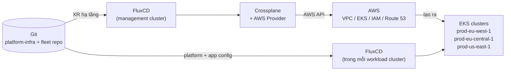

# Crossplane – Ghi chú học từ series "Multi-Region EKS Platform"

Thư mục này là ghi chú học Crossplane, xây dựng từ 2 bài viết của Konstantinos Dichalas trên Medium (tháng 6/2026). Cả 2 bài đều ở mức **high level**: mô tả kiến trúc và trách nhiệm của từng thành phần, không đi vào YAML XRD / Composition chi tiết. Ghi chú này giữ đúng mức đó, và bổ sung một phần kiến thức nền về Crossplane ở file 02 để đọc bài dễ hơn.

## Bức tranh trong 1 đoạn

Git là source of truth. FluxCD trong management cluster đọc Git và apply các XR (ví dụ `RegionalCluster`, bài blog gọi là "claim") vào cluster đó. Crossplane, cũng chạy trong management cluster, đọc XR và tạo hạ tầng AWS thật (VPC, EKS, IAM, Route 53...). Mỗi EKS cluster được tạo ra lại chạy FluxCD của riêng nó để reconcile platform controller và application. Promotion engine và orchestration app chỉ **tạo Git change**, không bao giờ apply trực tiếp vào cluster.

## Phiên bản đối chiếu

Bài blog viết tháng 6/2026 nhưng dùng thuật ngữ "claim" của Crossplane v1. Ghi chú này đối chiếu với tài liệu chính thức **Crossplane v2.4** (release mới nhất v2.4.2, 22/9/2026) và **provider-upjet-aws v2.8.1**. Trong v2, XR là namespaced và không cần Claim, nên chỗ bài viết nói "claim `RegionalCluster`" thì ghi chú gọi là **XR `RegionalCluster`**. Chi tiết ở [file 02](docs/02-crossplane-concepts.md).

## Thứ tự đọc

| # | File | Trả lời câu hỏi |
|---|------|-----------------|
| 1 | [Tổng quan kiến trúc](docs/01-tong-quan-kien-truc.md) | Hệ thống gồm những lớp nào, ai sở hữu cái gì, management cluster khác workload cluster ở đâu? |
| 2 | [Crossplane concepts](docs/02-crossplane-concepts.md) | Provider, Managed Resource, XRD, Composition, Function, XR liên hệ với nhau thế nào theo Crossplane v2? `RegionalCluster` trong bài là gì? |
| 3 | [Luồng GitOps](docs/03-luong-gitops.md) | Từ một pull request đến khi AWS resource tồn tại, chuyện gì xảy ra? |
| 4 | [Multi-region](docs/04-multi-region.md) | Nhiều region được tách thế nào, traffic đi về đâu, active-active hay active-passive? |
| 5 | [Promotion và onboarding](docs/05-promotion-va-onboarding.md) | Lớp phía trên Crossplane: app team onboard ra sao, version được promote qua region thế nào? |
| 6 | [Glossary](docs/06-glossary.md) | Bảng thuật ngữ Anh → giải thích ngắn tiếng Việt. |

File 2 là trọng tâm nếu mục tiêu là học Crossplane. File 5 nói về lớp ngoài Crossplane, đọc để hiểu Crossplane đứng ở đâu trong bức tranh lớn.

## Ba tên cluster dùng xuyên suốt

| Cluster | Vai trò |
|---------|---------|
| management cluster | Platform control plane. Chạy Crossplane, FluxCD, orchestration app, promotion engine. Không chạy workload. |
| `prod-eu-west-1`, `prod-eu-central-1`, `prod-us-east-1` | Workload cluster, mỗi cái ở một AWS region, mỗi cái chạy FluxCD riêng. |

## Nguồn

Series của Konstantinos Dichalas:

1. [Building a Multi-Region EKS Platform with Crossplane, FluxCD, and GitOps](https://medium.com/@kostasdihalas/building-a-multi-region-eks-platform-with-crossplane-fluxcd-and-gitops-c0b3ea4dd567) – 18/6/2026. Kiến trúc tổng thể.
2. [Provisioning Multi-Region AWS Infrastructure with Crossplane](https://medium.com/@kostasdihalas/provisioning-multi-region-aws-infrastructure-with-crossplane-c5010fb39b5f) – 22/6/2026. Lớp hạ tầng với Crossplane.
