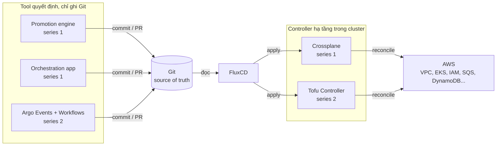

# Platform engineering trên EKS – ghi chú học

Ghi chú tiếng Việt (giữ thuật ngữ tiếng Anh) về xây platform trên Amazon EKS theo GitOps, bắt đầu từ Crossplane. Mỗi phần bám một nguồn, đối chiếu với tài liệu chính thức và version mới nhất tại thời điểm viết, có diagram Mermaid render trực tiếp trên GitHub.

## Ba phần

| Phần | Nguồn | Câu hỏi chính |
|------|-------|---------------|
| [01 – Crossplane multi-region](docs/01-crossplane-multi-region/) | Series 2 bài Medium của Konstantinos Dichalas (6/2026) | Crossplane là gì, quản lý nhiều region bằng API platform thế nào, Flux và promotion engine đứng ở đâu? |
| [02 – EKS SaaS GitOps](docs/02-eks-saas-gitops/) | Workshop AWS "Building SaaS applications on Amazon EKS using GitOps" | Multi-tenant SaaS trên một cluster: tier Basic, Advanced, Premium; Tofu Controller; Argo Events và Workflows; Flux automation; staggered deployment. |
| [03 – Tool decision guide](docs/03-tool-decision-guide.md) | Tổng hợp từ hai nguồn, mở rộng landscape | Khi nào Crossplane, khi nào Tofu Controller, Flux hay Argo CD, tự viết orchestration hay Argo Workflows, promote bằng gì? |

## Bức tranh chung

Cả hai nguồn cùng một xương sống: Git là source of truth, Flux là thứ duy nhất apply vào cluster, hạ tầng cloud do một controller trong cluster reconcile (Crossplane ở series 1, Tofu Controller ở series 2), và mọi tool "quyết định" (promotion engine, orchestration app, Argo Workflows) chỉ được ghi vào Git.

## Phần 1 – Crossplane multi-region

| # | File | Trả lời câu hỏi |
|---|------|-----------------|
| 1 | [Tổng quan kiến trúc](docs/01-crossplane-multi-region/01-tong-quan-kien-truc.md) | Hệ thống gồm những lớp nào, ai sở hữu cái gì, management cluster khác workload cluster ở đâu? |
| 2 | [Crossplane concepts](docs/01-crossplane-multi-region/02-crossplane-concepts.md) | Provider, Managed Resource, XRD, Composition, Function, XR liên hệ với nhau thế nào theo Crossplane v2? `RegionalCluster` trong bài là gì? |
| 3 | [Luồng GitOps](docs/01-crossplane-multi-region/03-luong-gitops.md) | Từ một pull request đến khi AWS resource tồn tại, chuyện gì xảy ra? |
| 4 | [Multi-region](docs/01-crossplane-multi-region/04-multi-region.md) | Nhiều region được tách thế nào, traffic đi về đâu, active-active hay active-passive? |
| 5 | [Promotion và onboarding](docs/01-crossplane-multi-region/05-promotion-va-onboarding.md) | App team onboard ra sao, version được promote qua region thế nào? |
| 6 | [Glossary](docs/01-crossplane-multi-region/06-glossary.md) | Thuật ngữ Crossplane và GitOps. |

Bài blog dùng chữ "claim" theo Crossplane v1. Ghi chú đối chiếu với Crossplane v2 (XR namespaced, không cần Claim, Composition là pipeline Function) và gọi `RegionalCluster` là XR.

## Phần 2 – EKS SaaS GitOps

| # | File | Trả lời câu hỏi |
|---|------|-----------------|
| 1 | [Tổng quan workshop](docs/02-eks-saas-gitops/01-tong-quan.md) | Ba plane trong repo GitOps, thứ tự Flux Kustomization, tool nào ở đâu, hai luồng thay đổi. |
| 2 | [Tenant tiers](docs/02-eks-saas-gitops/02-tenant-tiers.md) | Basic, Advanced, Premium khác gì; ánh xạ vào Pool, Bridge, Silo; một chart phục vụ ba tier bằng cách nào; chọn model cho một microservice. |
| 3 | [Tofu Controller](docs/02-eks-saas-gitops/03-tofu-controller.md) | Terraform CR sinh từ Helm chart, version module bằng git tag, runner và state, so với Crossplane. |
| 4 | [Argo Events và Workflows](docs/02-eks-saas-gitops/04-argo-events-workflows.md) | SQS → EventSource → Sensor → Workflow → commit Git; onboarding, offboarding, deployment. |
| 5 | [Flux automation và rollout](docs/02-eks-saas-gitops/05-flux-automation-va-rollout.md) | Image automation, semver wildcard, rollback, staggered deployment theo tier. |
| 6 | [Glossary](docs/02-eks-saas-gitops/06-glossary.md) | Thuật ngữ SaaS, Tofu Controller, Argo, Flux image automation. |

## Phần 3 – Tool decision guide

[docs/03-tool-decision-guide.md](docs/03-tool-decision-guide.md): sáu câu hỏi trước khi chọn tool, bản đồ 5 lớp (infra provisioning, GitOps, workflow, promotion, packaging), bảng so sánh từng lớp với rule of thumb, bốn kịch bản ghép bộ, bảng version tổng hợp.

## Version đối chiếu

Kiểm tra qua GitHub releases và docs chính thức. Ngày kiểm tra ghi trong từng file.

| Tool | Version | Ngày |
|------|---------|------|
| Crossplane | v2.4.2 | 22/9/2026 |
| provider-upjet-aws | v2.8.1 | 21/9/2026 |
| Flux | v2.9.5 | 31/8/2026 |
| Tofu Controller | v0.16.5 | 6/8/2026 |
| Argo Workflows | v4.1.4 | 18/9/2026 |
| Argo Events | v1.9.11 | 13/7/2026 |
| Argo CD | v3.5.3 | 14/9/2026 |
| Kargo | v1.11.4 | 3/9/2026 |
| kro | v0.9.4 | 4/9/2026 |
| Karpenter (AWS) | v1.14.1 | 21/8/2026 |
| AWS Load Balancer Controller | v3.5.0 | 3/8/2026 |

## Nguồn

- Konstantinos Dichalas: [Building a Multi-Region EKS Platform with Crossplane, FluxCD, and GitOps](https://medium.com/@kostasdihalas/building-a-multi-region-eks-platform-with-crossplane-fluxcd-and-gitops-c0b3ea4dd567) (18/6/2026), [Provisioning Multi-Region AWS Infrastructure with Crossplane](https://medium.com/@kostasdihalas/provisioning-multi-region-aws-infrastructure-with-crossplane-c5010fb39b5f) (22/6/2026).
- AWS: [Building SaaS applications on Amazon EKS using GitOps](https://catalog.workshops.aws/eks-saas-gitops/en-US/01-introduction), repo [aws-samples/eks-saas-gitops](https://github.com/aws-samples/eks-saas-gitops), [AWS Well-Architected SaaS Lens](https://docs.aws.amazon.com/wellarchitected/latest/saas-lens/silo-pool-and-bridge-models.html).
- Docs chính thức: [Crossplane](https://docs.crossplane.io/latest/), [Flux](https://fluxcd.io/flux/), [Tofu Controller](https://flux-iac.github.io/tofu-controller/), [Argo Workflows](https://argo-workflows.readthedocs.io/), [Argo Events](https://argoproj.github.io/argo-events/).
