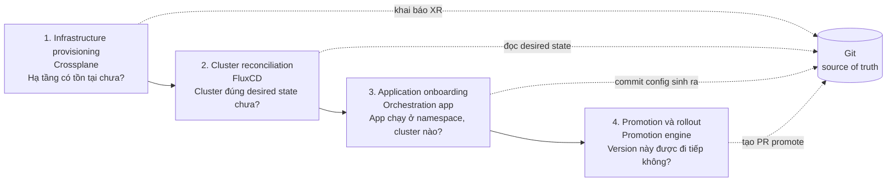
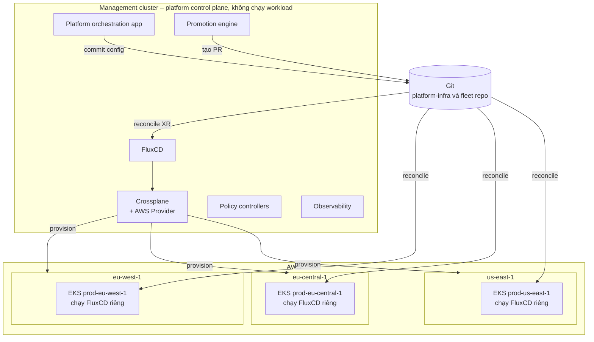

# 01 – Tổng quan kiến trúc

File này trả lời: hệ thống multi-region EKS trong series gồm những lớp nào, thành phần nào sở hữu việc gì, và tại sao management cluster phải tách khỏi workload cluster. Đây là khung để đặt Crossplane vào đúng chỗ trước khi đi sâu vào nó ở file 02.

## Vấn đề cần giải

Một EKS cluster thì dễ: một ingress, một pipeline, một bộ Helm values, một chỗ để nhìn khi lỗi. Multi-region đổi hình dạng bài toán. Với 3 cluster `prod-eu-west-1`, `prod-eu-central-1`, `prod-us-east-1`, câu hỏi trở thành:

- Ai tạo hạ tầng AWS? Ai sở hữu EKS cluster?
- App được onboard vào cluster thế nào?
- Làm sao tránh drift giữa các cluster?
- Promote version qua từng region sao cho an toàn?
- Đang chạy version nào ở region nào?
- Một region chết thì phục hồi thế nào?

Mỗi region cần cùng bộ platform component (aws-load-balancer-controller, external-dns, cert-manager, observability, gateway, namespace, network policy, secrets) nhưng lại khác nhau ở cấu hình (account, region, domain, replica, AZ, traffic weight, failover role). Quản lý tay thì drift gần như chắc chắn: một cluster lệch version controller, một cluster thiếu policy, một cluster bị patch tay lúc incident rồi không bao giờ reconcile lại.

## Bốn lớp và chủ sở hữu

Tác giả tách platform thành 4 lớp, mỗi lớp có một owner và một câu hỏi duy nhất mà nó trả lời.

| Lớp | Owner | Câu hỏi nó trả lời | Không được làm |
|-----|-------|--------------------|----------------|
| 1. Infrastructure provisioning | **Crossplane** | Hạ tầng AWS có tồn tại đúng như khai báo chưa? | Quyết định release, dịch chuyển traffic |
| 2. Cluster reconciliation | **FluxCD** | Cluster có đúng desired state trong Git chưa? | Quyết định version nào được lên prod |
| 3. Application onboarding | **Platform orchestration app** | App này cần Namespace, RBAC, Flux resource gì? | Apply trực tiếp vào cluster |
| 4. Promotion và rollout | **Promotion engine** (dùng GitHub Deployments) | Version này được phép đi tới target tiếp theo không? | Chạy `kubectl apply` ngầm |

Quy tắc quan trọng nhất: **không lớp nào được bypass Git**. Orchestration app sinh config thì phải commit vào Git. Promotion engine quyết định promote thì kết quả phải là một Git change. Crossplane tạo hạ tầng thì desired state vẫn phải là Kubernetes resource nằm trong Git. Nhờ vậy toàn bộ platform review được, audit được, debug được.

## Management cluster và workload cluster

Management cluster **không chạy application**. Nó là nơi platform control plane sống. Một management cluster tối giản chạy:

- Crossplane và Crossplane AWS provider
- Platform orchestration app
- Promotion engine
- Policy controllers
- Observability components

Ba workload cluster nằm ở ba region, mỗi cái chạy FluxCD của riêng mình và reconcile độc lập. Nếu region này có sự cố, cluster ở region khác không phụ thuộc vào nó.

Đọc diagram theo hai chiều:

- **Chiều xuống** (Git → FluxCD → Crossplane → AWS): tạo và giữ hạ tầng đúng khai báo.
- **Chiều lên** (Orchestration app, Promotion engine → Git): hai thành phần này chỉ viết vào Git, sau đó chờ Flux ở cluster đích reconcile.

## Crossplane đứng ở đâu

Trong bức tranh này Crossplane chỉ lo lớp 1. Nó chạy trong management cluster, biến hạ tầng AWS thành Kubernetes resource, và để platform team định nghĩa "sản phẩm hạ tầng" (ví dụ `RegionalCluster`) thay vì bắt mọi team hiểu từng AWS object. Chi tiết cách nó làm điều đó ở [file 02](02-crossplane-concepts.md).

## Nguồn

- [Building a Multi-Region EKS Platform with Crossplane, FluxCD, and GitOps](https://medium.com/@kostasdihalas/building-a-multi-region-eks-platform-with-crossplane-fluxcd-and-gitops-c0b3ea4dd567) – mục "The problem with multi-region platforms", "The platform model", "High-level architecture".
- [Provisioning Multi-Region AWS Infrastructure with Crossplane](https://medium.com/@kostasdihalas/provisioning-multi-region-aws-infrastructure-with-crossplane-c5010fb39b5f) – mục "The management cluster".
