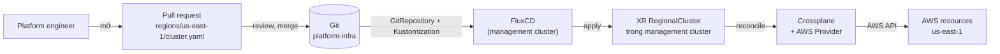
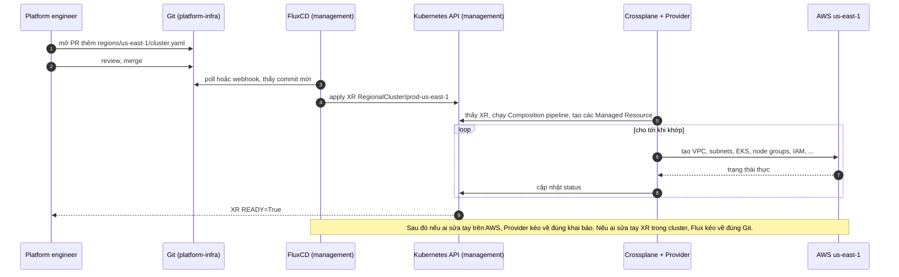

# 03 – Luồng GitOps cho hạ tầng

File này trả lời: từ lúc một platform engineer mở pull request đến lúc AWS resource tồn tại, chuyện gì xảy ra và thành phần nào làm gì. Điểm mấu chốt: Crossplane chạy trong Kubernetes, nhưng desired state vẫn nằm trong Git, và Flux là cầu nối.

## Repo hạ tầng

Bài viết đề xuất một repo `platform-infra` chia theo region. Mỗi region có 3 file, tách theo mối quan tâm.

```text
platform-infra/
└── regions/
    ├── eu-west-1/
    │   ├── cluster.yaml     # XR RegionalCluster/prod-eu-west-1
    │   ├── network.yaml     # network / VPC config
    │   └── dns.yaml         # Route 53, traffic policy
    ├── eu-central-1/
    │   ├── cluster.yaml
    │   ├── network.yaml
    │   └── dns.yaml
    └── us-east-1/
        ├── cluster.yaml
        ├── network.yaml
        └── dns.yaml
```

Bài viết chỉ đưa cây thư mục, không nói rõ nội dung từng file. Với `cluster.yaml` thì hợp lý nhất là XR `RegionalCluster` như ở [file 02](02-crossplane-concepts.md). `network.yaml` và `dns.yaml` là các XR hoặc Managed Resource khác cùng region.

## Chuỗi GitOps

Flux trong management cluster reconcile repo này vào management cluster. Kết quả là các XR xuất hiện trong Kubernetes API. Crossplane thấy XR và reconcile AWS. Hai controller, hai vòng lặp, nối với nhau bằng Kubernetes API.



Hai vòng reconcile độc lập:

| Vòng | Controller | Nguồn | Đích |
|------|------------|-------|------|
| GitOps | FluxCD | Git `platform-infra` | Kubernetes API của management cluster |
| Hạ tầng | Crossplane + Provider | XR, MR trong management cluster | AWS API |

## Từ merge đến cluster Ready



## Mọi thay đổi hạ tầng là một pull request

Đây là lý do pattern này mạnh:

- Thêm region mới là một Git change.
- Thêm cluster mới là một Git change.
- Đổi DNS policy là một Git change.
- Cập nhật IAM policy là một Git change.

Review, approve, audit, rollback đều đi qua Git. Không ai `kubectl apply` hay bấm console.

## Luồng thứ hai: Flux trong workload cluster

Ngoài luồng hạ tầng ở trên, mỗi EKS cluster sau khi được tạo lại chạy FluxCD của riêng mình. Flux đó đọc một repo khác (fleet repo) và reconcile platform controller, tenant namespace, RBAC, network policy, application manifest, HelmRelease, Kustomize overlay. Mỗi cluster reconcile độc lập, nên một region gặp sự cố không kéo theo region khác. Ai ghi vào fleet repo và như thế nào nằm ở [file 05](05-promotion-va-onboarding.md).

## Nguồn

- [Provisioning Multi-Region AWS Infrastructure with Crossplane](https://medium.com/@kostasdihalas/provisioning-multi-region-aws-infrastructure-with-crossplane-c5010fb39b5f) – mục "GitOps for infrastructure".
- [Building a Multi-Region EKS Platform with Crossplane, FluxCD, and GitOps](https://medium.com/@kostasdihalas/building-a-multi-region-eks-platform-with-crossplane-fluxcd-and-gitops-c0b3ea4dd567) – mục "Why FluxCD?".
