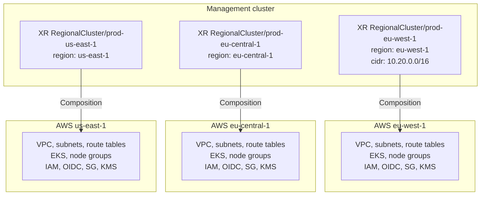
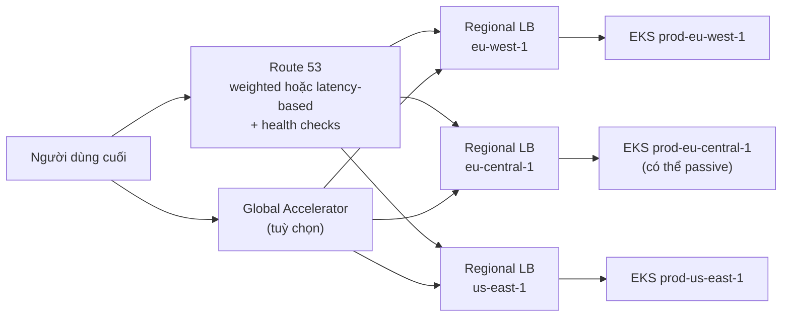

# 04 – Multi-region

File này trả lời: nhiều region được tách và sở hữu thế nào trong Crossplane, cái gì giống nhau và cái gì được phép khác giữa các region, và traffic từ người dùng đi về region nào.

## Mỗi region là một XR độc lập

Trong management cluster có 3 XR `RegionalCluster` (bài gọi là "claim"), mỗi XR tạo AWS resource ở đúng một region.

| XR | Region | Tạo resource ở |
|-------|--------|----------------|
| `RegionalCluster/prod-eu-west-1` | eu-west-1 | eu-west-1 |
| `RegionalCluster/prod-eu-central-1` | eu-central-1 | eu-central-1 |
| `RegionalCluster/prod-us-east-1` | us-east-1 | us-east-1 |

Lợi ích trực tiếp là **ranh giới sở hữu** và **ranh giới lỗi** đều rõ. Provision hỏng ở một region không buộc phải đụng vào region khác.

Ba stack cùng một Composition nên cùng hình dạng. Không có mũi tên ngang giữa các region: đó chính là failure boundary.

## Giống nhau ở đâu, khác nhau ở đâu

| Giống nhau (do Composition ép) | Khác nhau (do field trong XR) |
|--------------------------------|----------------------------------|
| Tagging strategy | Kích cỡ node group (`prod-eu-west-1` lớn hơn) |
| Baseline IAM model | Availability zones (`prod-us-east-1` khác) |
| Network layout | Vai trò active hay passive (`prod-eu-central-1` có thể khởi đầu passive) |
| Encryption default | CIDR, cluster version |
| Observability integration | |
| Policy control | |

Nguyên tắc: **shape giống nhau, tham số khác nhau**. Đây là điểm Composition mang lại mà quản lý tay hoặc Terraform rời rạc khó giữ được lâu.

## Lớp traffic

Hạ tầng multi-region không chỉ là EKS. Cần cả routing để người dùng tới đúng region. Tuỳ kiến trúc, platform có thể provision qua Crossplane:

- Route 53 records
- Weighted routing policy
- Latency-based routing policy
- Health checks
- Global Accelerator endpoints
- Regional load balancers

Crossplane có thể khai báo các resource này, nhưng **quyết định quan trọng là kiến trúc, không phải công cụ**:

- App là active-active hay active-passive?
- Traffic chia theo weight không?
- Failover tự động hay điều khiển tay?

Câu trả lời khác nhau theo từng app. Một frontend stateless có thể active-active. Một dịch vụ giao dịch tài chính có thể active-passive. Một hệ batch có thể không cần global routing. Platform nên hỗ trợ các pattern này **một cách tường minh** thay vì giả định mọi app giống nhau.

| Pattern | Traffic | Failover | Ví dụ |
|---------|---------|----------|-------|
| Active-active | Chia ra nhiều region cùng lúc (weighted, latency) | Tự động khi health check fail | Frontend stateless |
| Active-passive | Một region nhận toàn bộ, region khác chờ | Tự động hoặc tay, tuỳ mức rủi ro | Dịch vụ giao dịch tài chính |
| Không global routing | Chạy trong region, không expose ra ngoài | Không áp dụng | Hệ batch |

## Nguồn

- [Provisioning Multi-Region AWS Infrastructure with Crossplane](https://medium.com/@kostasdihalas/provisioning-multi-region-aws-infrastructure-with-crossplane-c5010fb39b5f) – mục "Crossplane and multi-region infrastructure", "DNS and traffic resources", "Why compositions are useful".
