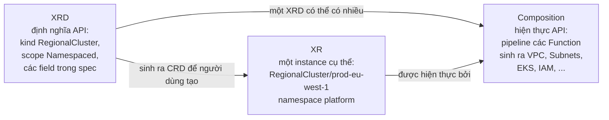
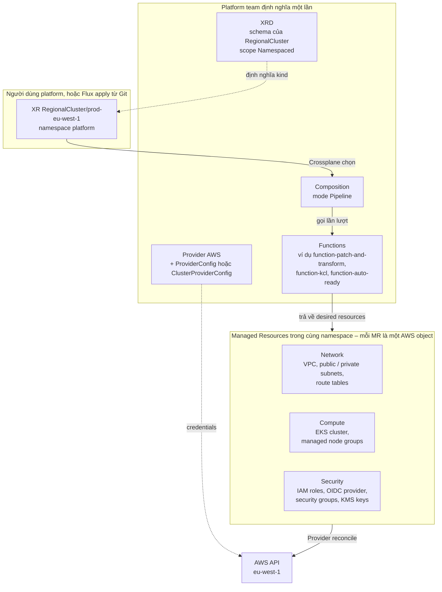
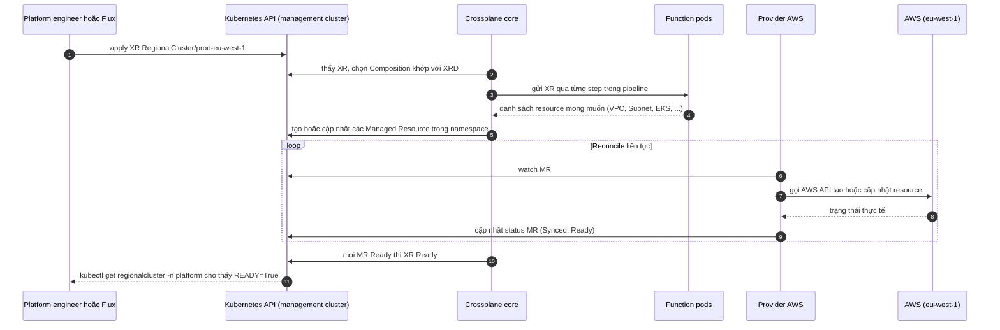

# 02 – Crossplane concepts

File này trả lời: các khái niệm cốt lõi của Crossplane (Provider, Managed Resource, XRD, Composition, Function, XR) liên hệ với nhau thế nào, và `RegionalCluster` trong bài viết rơi vào khái niệm nào theo Crossplane hiện tại. Đây là file trọng tâm nếu mục tiêu là học Crossplane.

> **Phiên bản đối chiếu.** Ghi chú này đối chiếu với tài liệu chính thức docs.crossplane.io phiên bản v2.4 và release mới nhất trên GitHub tại ngày 24/9/2026.
>
> | Thành phần | Phiên bản mới nhất | Ngày |
> |------------|--------------------|------|
> | Crossplane | v2.4.2 | 22/9/2026 |
> | Crossplane dòng v1 (còn maintain) | v1.20.13 | 15/9/2026 |
> | provider-upjet-aws (Provider AWS) | v2.8.1 | 21/9/2026 |
>
> Hai bài blog dùng chữ "claim" theo cách nói của Crossplane v1. Crossplane v2 (từ giữa 2025) đã đổi mô hình: XR namespaced, không cần Claim. Phần dưới trình bày theo v2 và ghi rõ chỗ nào là v1 legacy.

## Ý tưởng gốc

Crossplane là **control plane framework**: nó biến cloud resource (và bất kỳ Kubernetes resource nào) thành object trong Kubernetes API, có controller reconcile liên tục để trạng thái thực khớp với khai báo. Nếu ai sửa tay trên AWS, Crossplane kéo về đúng desired state. Từ đó platform team xây **API mức platform** ("cho tôi một cluster ở region X") thay vì bắt người dùng hiểu 20 AWS object.

## Chuỗi khái niệm

Đọc từ dưới lên (từ AWS lên tới người dùng). Cột cuối là ánh xạ vào bài blog.

| Khái niệm | Vai trò | Ai tạo | Trong bài |
|-----------|---------|--------|-----------|
| **Provider** | Package cài vào cluster, mang controller và CRD cho một hệ bên ngoài. Với AWS là `provider-upjet-aws` (chia nhỏ theo service: ec2, eks, iam...). | Platform team, cài một lần | "Crossplane AWS provider" |
| **ProviderConfig** / **ClusterProviderConfig** | Cách Provider xác thực với AWS (credentials, IAM role, account). v2: `ProviderConfig` là namespaced, `ClusterProviderConfig` dùng chung toàn cluster. MR không khai báo thì dùng `ClusterProviderConfig` tên `default`. | Platform team | Không nêu tên, ngầm định |
| **Managed Resource (MR)** | Một object Kubernetes ứng với đúng một object AWS. `VPC` ↔ một VPC thật. Provider reconcile MR. v2: MR **namespaced**, MR cluster-scoped là legacy. | Thường do Composition tạo, ít khi tạo tay | VPC, subnets, route tables, EKS cluster, node groups, IAM roles, OIDC provider, security groups, KMS keys |
| **CompositeResourceDefinition (XRD)** | Định nghĩa **API mới**: group, kind, version, các field trong `spec`. v2 có field `scope`: `Namespaced` (mặc định, khuyến nghị), `Cluster`, hoặc `LegacyCluster` (v1, có Claim). | Platform team | Schema của `RegionalCluster` (region, environment, clusterVersion, network, nodePools) |
| **Composition** | Hiện thực API đó. v2: Composition **luôn là một pipeline của Functions** (`mode: Pipeline`). Native patch-and-transform đã bị gỡ. Một XRD có thể có nhiều Composition. | Platform team | "compositions ... package multiple resources into one higher-level unit" |
| **Function** | Extension chạy như pod, nhận XR và trả về danh sách resource cần tạo. Ví dụ `function-patch-and-transform` (template kiểu YAML), `function-kcl`, `function-go-templating`, `function-python`, `function-auto-ready`. | Cộng đồng viết, platform team cài | Không nêu |
| **Composite Resource (XR)** | Instance của XRD, **thứ người dùng tạo**. v2: XR namespaced, có thể compose MR, Kubernetes resource thường (Deployment, Service) hay CRD bên thứ ba. Máy móc của Crossplane nằm gọn trong `spec.crossplane`. | Platform user, hoặc Flux apply từ Git | `RegionalCluster/prod-eu-west-1` trong namespace `platform` (bài gọi là "claim") |
| **Claim** (legacy) | Chỉ tồn tại khi XRD dùng API v1 với `scope: LegacyCluster`. Là bản namespaced ủy quyền cho một XR cluster-scoped. XRD kiểu v2 **không hỗ trợ Claim**. | Platform user (mô hình v1) | Chữ "claim" trong bài |
| **Operation** (alpha) | Chạy function pipeline **một lần tới khi xong** như Job, thay vì reconcile liên tục. Có `Operation`, `CronOperation`, `WatchOperation`. Dùng cho bảo trì, rolling upgrade, phản ứng khi resource đổi. | Platform team | Không nêu |



Cách nhớ nhanh: **XRD là interface, Composition là implementation, XR là instance.** Function là công cụ Composition dùng để sinh resource.

## `RegionalCluster` trong bài là gì

Bài viết cho ví dụ "claim" mà platform muốn expose:

```yaml
apiVersion: platform.example.com/v1alpha1
kind: RegionalCluster
metadata:
  name: prod-eu-west-1
  namespace: platform
spec:
  region: eu-west-1
  environment: production
  clusterVersion: "1.32"
  network:
    cidr: 10.20.0.0/16
  nodePools:
    - name: general
      instanceType: m7i.large
      minSize: 3
      maxSize: 20
```

Theo Crossplane v2, đúng cái YAML này **là một XR namespaced**, không cần lớp Claim trung gian. Platform team tạo XRD `regionalclusters.platform.example.com` với `scope: Namespaced`, người dùng tạo object `RegionalCluster` trực tiếp trong namespace `platform`. Nếu platform vẫn chạy mô hình v1 (XRD API v1, `LegacyCluster`), thì đây mới thật là một Claim, và Crossplane sẽ tạo thêm một XR cluster-scoped phía sau.

Dù mô hình nào, điểm tác giả nhấn mạnh không đổi: người tạo `RegionalCluster` không cần biết bên dưới có bao nhiêu AWS resource, và platform engineer có thể đổi Composition (thêm KMS key, đổi tagging) mà không đổi API người dùng nhìn thấy.

## Từ XR tới AWS resource



Khác biệt lớn so với v1: trước đây cần Claim namespaced ủy quyền cho XR cluster-scoped, rồi XR tạo MR cluster-scoped. Giờ XR và MR đều nằm trong một namespace, RBAC theo namespace hoạt động bình thường, và Composition có thể sinh cả resource không phải của Crossplane (Deployment, Service, CRD bên thứ ba) nếu được cấp quyền.

## Vòng reconcile

Crossplane không chạy một lần rồi xong. Mọi tầng đều là controller reconcile liên tục. Trạng thái Ready lan từ MR lên XR.



## Tại sao Composition đáng giá

Thay vì yêu cầu ai đó tạo đúng 20 AWS resource, platform expose một resource. Điều đó cho **tính nhất quán**: mọi production cluster có cùng

- tagging strategy
- baseline IAM model
- network layout
- encryption default
- observability integration
- policy control

Các region vẫn khác nhau được ở chỗ cần khác: `prod-eu-west-1` node group lớn hơn, `prod-us-east-1` AZ khác, `prod-eu-central-1` có thể khởi đầu ở trạng thái passive. Nhưng **hình dạng** hạ tầng thì giống nhau.

Bài 1 còn gợi ý các abstraction khác mà platform có thể định nghĩa bằng cùng cơ chế: `CompositeEKSCluster`, `CompositeRegionalNetwork`, `CompositeApplicationDNS`, `CompositeTenantNamespace`.

## Crossplane không nên sở hữu gì

Crossplane sở hữu hạ tầng, **không** sở hữu tiến trình release. Nó không quyết định version `1.4.2` của `payment-service` đã sẵn sàng cho production hay chưa, không quyết định dịch traffic giữa hai version, và không thay thế promotion engine.

| Thành phần | Câu hỏi nó trả lời |
|------------|--------------------|
| Crossplane | Hạ tầng có tồn tại chưa? |
| Flux | Cluster đã reconcile về desired state chưa? |
| Promotion engine | Version này được phép đi tới target tiếp theo không? |

Lớp Flux và promotion engine nằm ở [file 03](03-luong-gitops.md) và [file 05](05-promotion-va-onboarding.md).

## Những gì v2 đã gỡ bỏ

Đọc tài liệu hay blog cũ về Crossplane sẽ gặp các thứ sau. Chúng không còn trong v2:

| Bị gỡ | Thay bằng |
|-------|-----------|
| Native patch-and-transform trong Composition (`mode: Resources`) | `mode: Pipeline` với `function-patch-and-transform` hoặc Function khác |
| `ControllerConfig` | `DeploymentRuntimeConfig` |
| External secret stores | Không có thay thế trong core |
| Connection details ở mức XR | Tự compose một `Secret` trong Composition |
| Registry mặc định cho package | Phải ghi URL đầy đủ, ví dụ `xpkg.crossplane.io/...` |
| Claim cho XRD kiểu v2 | XR namespaced. Claim chỉ còn ở `scope: LegacyCluster` |

## Nguồn

Bài blog:

- [Provisioning Multi-Region AWS Infrastructure with Crossplane](https://medium.com/@kostasdihalas/provisioning-multi-region-aws-infrastructure-with-crossplane-c5010fb39b5f) – mục "Crossplane as the AWS provisioning layer", "Example platform claim", "Why compositions are useful", "What Crossplane should not own".
- [Building a Multi-Region EKS Platform with Crossplane, FluxCD, and GitOps](https://medium.com/@kostasdihalas/building-a-multi-region-eks-platform-with-crossplane-fluxcd-and-gitops-c0b3ea4dd567) – mục "Why Crossplane?".

Tài liệu chính thức (v2.4, đọc ngày 24/9/2026):

- [What's Crossplane](https://docs.crossplane.io/latest/whats-crossplane/)
- [What's new in Crossplane v2](https://docs.crossplane.io/latest/whats-new/) – namespaced XR/MR, compose any resource, Operations, breaking changes.
- [Composite Resource Definitions](https://docs.crossplane.io/latest/composition/composite-resource-definitions/) – field `scope`.
- [Compositions](https://docs.crossplane.io/latest/composition/compositions/) – pipeline of functions.
- [Managed Resources](https://docs.crossplane.io/latest/managed-resources/managed-resources/) – `providerConfigRef`, ProviderConfig và ClusterProviderConfig.
- [Crossplane releases](https://github.com/crossplane/crossplane/releases), [provider-upjet-aws releases](https://github.com/crossplane-contrib/provider-upjet-aws/releases).
