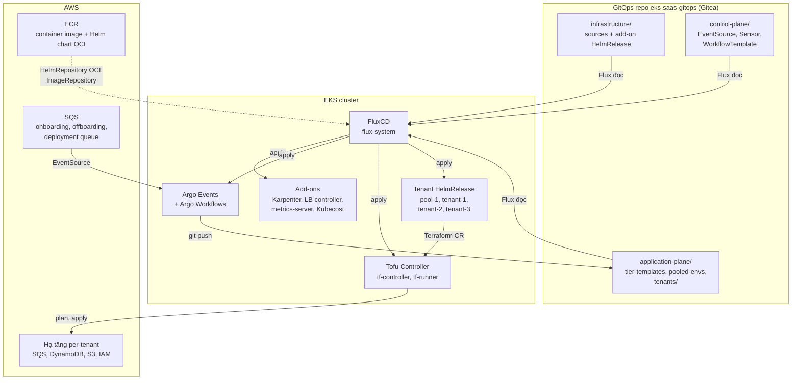
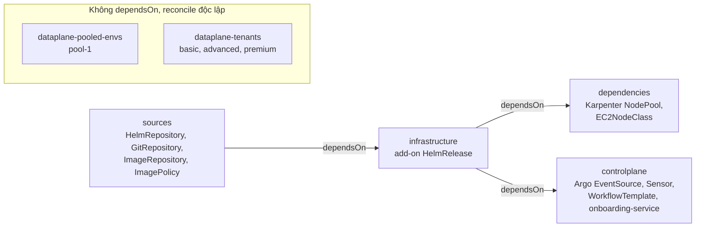

# 01 – Tổng quan workshop "Building SaaS applications on Amazon EKS using GitOps"

File này trả lời: workshop của AWS giải bài toán gì, kiến trúc chia thành những phần nào, tool nào đứng ở đâu, và nó khác gì so với series Crossplane multi-region ở [phần 1](../01-crossplane-multi-region/01-tong-quan-kien-truc.md). Đây là khung để đọc 4 file kỹ thuật tiếp theo.

> **Nguồn và phiên bản.** Workshop tại catalog.workshops.aws/eks-saas-gitops (đọc ngày 25/9/2026), repo mã nguồn github.com/aws-samples/eks-saas-gitops (commit cuối 10/4/2026). Workshop cài các tool bằng chart phiên bản 2024, phần lớn đã cũ so với release hiện tại. Bảng đối chiếu ở cuối file.

## Bài toán: DevOps cho SaaS khác gì

SaaS là "chạy phần mềm thay khách hàng", nên phải thay đổi liên tục và đồng nhất cho mọi tenant. Ba mục tiêu tác giả nêu:

- **Frequent releases**: phản hồi nhanh, ra tính năng nhanh.
- **Operational efficiency**: quản lý mọi tenant bằng cùng một quy trình.
- **Automated onboarding**: tạo tenant mới nhanh, nhất quán, không làm tay.

Khó ở chỗ tenant không giống nhau. SaaS có 3 mô hình triển khai: **silo** (tài nguyên riêng), **pool** (dùng chung), **hybrid** hay **bridge** (trộn). Onboarding phải tạo đúng bộ tài nguyên theo mô hình của tenant, và pipeline release phải cập nhật được tất cả tenant khi có version mới. Chi tiết ở [file 02](02-tenant-tiers.md).

## Hai pattern xương sống

**1. Đóng gói app và infra thành một package.** Ứng dụng được đóng gói **không** kèm cấu hình tier hay tenant, chỉ nhận tham số. Hạ tầng đi kèm (SQS, DynamoDB, IAM) là một Terraform module. Một Helm chart duy nhất bao cả Kubernetes resource và một `Terraform` custom resource trỏ tới đúng phiên bản module. Nhờ Tofu Controller, chart có thể tái dùng module Terraform sẵn có mà không sửa gì. Chi tiết ở [file 03](03-tofu-controller.md).

**2. Giữ mọi môi trường nhất quán bằng GitOps.** Flux v2 reconcile từ Git, đóng vai "immutability firewall": ai sửa tay trong cluster thì Flux kéo về đúng Git. Argo Workflows chỉ làm việc **sinh và commit file** cho onboarding, offboarding, staggered deployment. Chi tiết ở [file 04](04-argo-events-workflows.md) và [file 05](05-flux-automation-va-rollout.md).

Điểm chung với series Crossplane: không thành phần nào bypass Git. Điểm khác: series Crossplane dùng Crossplane cho hạ tầng, workshop dùng Terraform module qua Tofu Controller.

## Kiến trúc: một repo, ba plane

Repo GitOps `eks-saas-gitops` (host trên Gitea trong workshop) chia thành ba plane, cộng một thư mục `clusters/` chứa các Flux Kustomization nối chúng lại.

```text
eks-saas-gitops/
├── clusters/production/            # Flux Kustomization, dependsOn nối thứ tự
│   ├── sources.yaml                # → infrastructure/base/sources
│   ├── infrastructure.yaml         # → infrastructure/production
│   ├── dependencies.yaml           # → infrastructure/production/dependencies
│   ├── control-plane.yaml          # → control-plane/production
│   ├── pooled-envs.yaml            # → application-plane/production/pooled-envs
│   └── tenants.yaml                # → application-plane/production/tenants
├── infrastructure/
│   ├── base/sources/               # HelmRepository, GitRepository, ImageRepository, ImagePolicy
│   └── production/                 # HelmRelease add-on: metrics-server, Karpenter, Argo Workflows,
│                                   #   LB controller, Kubecost, Argo Events, tf-controller
├── control-plane/production/
│   ├── applications/               # onboarding-service (HelmRelease)
│   └── workflows/                  # EventBus, EventSource + Sensor, WorkflowTemplate
└── application-plane/production/
    ├── tier-templates/             # basic_env, basic_tenant, advanced_tenant, premium_tenant
    ├── pooled-envs/                # pool-1.yaml
    └── tenants/{basic,advanced,premium}/   # mỗi tenant một HelmRelease, sinh bởi Argo
```

Ngoài repo GitOps còn có `helm-charts/` (chart `helm-tenant-chart` cho tenant, chart `application-chart` cho service không thuộc tenant), `terraform/modules/tenant-apps` (module hạ tầng per-tenant), `tenant-microservices/{producer,consumer,payments}` và `workflow-scripts/` (image chạy trong Argo Workflows).



Đọc diagram theo hai vòng:

- **Vòng GitOps** (trái sang phải): Git → Flux → cluster → AWS. Flux là thứ duy nhất apply vào cluster.
- **Vòng điều khiển** (phải sang trái): SQS → Argo → Git. Argo chỉ ghi vào `application-plane/`, rồi chờ Flux.

## Thứ tự reconcile bằng dependsOn

Các Flux Kustomization trong `clusters/production/` nối nhau bằng `dependsOn`, và đều dùng `postBuild.substituteFrom` ConfigMap `saas-infra-outputs`. ConfigMap này do Terraform bootstrap ghi ra (account id, ECR URL, Gitea URL, IRSA role ARN, queue URL), là cầu nối giữa hạ tầng nền và GitOps.



Tenant và pool env không `dependsOn` vào lớp hạ tầng vì HelmRelease của chúng chỉ cần HelmRepository sẵn sàng. Nếu add-on chưa lên, HelmRelease sẽ retry, đó là hành vi mong muốn.

## Hai luồng thay đổi

| Luồng | Ai khởi động | Cơ chế | Ảnh hưởng | Lab |
|-------|--------------|--------|-----------|-----|
| Đổi code microservice | Developer push code | CI build image tag `prd-TIMESTAMP` → Flux image automation ghi tag mới vào HelmRelease → mọi tenant nhận | Tất cả tenant cùng lúc, chỉ đổi image tag | Lab 4 |
| Đổi package (chart + Terraform module) | Platform engineer | Bump major chart, tag module Terraform, sửa tier template → gửi SQS deployment theo tier → Argo cập nhật HelmRelease từng tier | Từng tier một, có thể kèm infra mới | Lab 5 |

Điểm quan trọng: wildcard `0.0.x` trong HelmRelease cho phép patch tự lên, nhưng major mới không tự lên. Đó là chốt an toàn để buộc đi qua deployment workflow theo tier.

## Tool trong workshop và phiên bản hiện tại

| Tool | Vai trò trong workshop | Version workshop cài | Mới nhất (25/9/2026) |
|------|------------------------|----------------------|----------------------|
| FluxCD | GitOps engine, Helm, image automation | API `helm.toolkit.fluxcd.io/v2beta1`, `image.toolkit.fluxcd.io/v1beta2` | v2.9.5, API `v2` và `v1` |
| Tofu Controller (flux-iac) | Chạy Terraform module từ `Terraform` CR | chart `0.16.0-rc.4` | v0.16.5 |
| Argo Workflows | Onboarding, offboarding, deployment workflow | chart `0.40.11` | app v4.1.4 |
| Argo Events | EventSource SQS, Sensor trigger Workflow | chart `2.4.3` | app v1.9.11 |
| Karpenter | Node autoscaling, ưu tiên Spot | `v0.34.1` | v1.14.1 |
| AWS Load Balancer Controller | ALB cho Ingress | chart `1.6.2` | xem bảng version ở README |
| Kubecost, metrics-server, Capacitor | Cost, metrics, Flux UI | `2.1.0`, `3.11.0` | không kiểm tra |
| Gitea | Git server + Gitea Actions CI trong workshop | trên EC2 | thay bằng GitHub, GitLab ngoài workshop |

Khác biệt API Flux đáng chú ý khi đọc YAML của workshop: `HelmRelease` nên dùng `helm.toolkit.fluxcd.io/v2`, các resource image automation nên dùng `image.toolkit.fluxcd.io/v1`. Flux v2.9.5 quay lại upstream Helm v4.

## Bản đồ 5 lab

| Lab | Nội dung | File ghi chú |
|-----|----------|--------------|
| Lab 1 | Terraform module, Tofu Controller, Helm chart, HelmRelease | [03](03-tofu-controller.md) |
| Lab 2 | Tier template Basic, Premium; tự tạo tier Advanced | [02](02-tenant-tiers.md) |
| Lab 3 | Onboarding 3 tier qua SQS + Argo, test, offboarding | [04](04-argo-events-workflows.md) |
| Lab 4 | Flux image automation, Helm chart update, rollback | [05](05-flux-automation-va-rollout.md) |
| Lab 5 | Thêm payments, bump major, staggered deployment theo tier | [05](05-flux-automation-va-rollout.md) |

## Nguồn

- Workshop: [Building SaaS applications on Amazon EKS using GitOps](https://catalog.workshops.aws/eks-saas-gitops/en-US/01-introduction) – mục "SaaS DevOps", "Reference Patterns & Tools", Lab 1 "Getting Started".
- Repo: [aws-samples/eks-saas-gitops](https://github.com/aws-samples/eks-saas-gitops) – `gitops/clusters/production/*.yaml`, README.
- [Flux v2.9.5 release notes](https://github.com/fluxcd/flux2/releases/tag/v2.9.5), [Flux HelmRelease API](https://fluxcd.io/flux/components/helm/helmreleases/), [Flux ImagePolicy API](https://fluxcd.io/flux/components/image/imagepolicies/).
