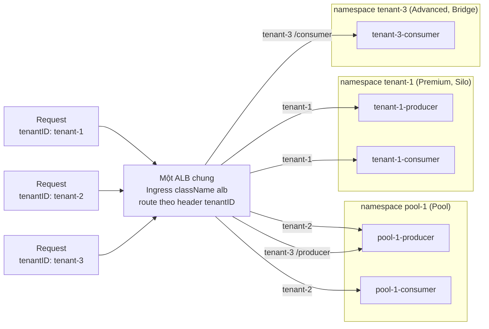

# 02 – Tenant tiers: Basic, Advanced, Premium

File này trả lời: ba tier trong workshop khác nhau ở đâu về kỹ thuật, chúng ánh xạ thế nào vào mô hình Silo, Pool, Bridge của AWS SaaS Lens, cơ chế nào làm một Helm chart phục vụ được cả ba, và nên hỏi gì khi quyết định một microservice đi silo hay pool.

## Tier và deployment model là hai thứ khác nhau

**Tier** là khái niệm kinh doanh: phân khúc khách hàng với giá và trải nghiệm khác nhau. **Deployment model** là khái niệm kỹ thuật, theo AWS SaaS Lens có ba loại:

| Model | Định nghĩa | Được gì | Mất gì |
|-------|------------|---------|--------|
| **Silo** | Tenant có tài nguyên riêng (namespace, deployment, database, queue). Vẫn dùng chung identity, onboarding và vận hành. | Cách ly mạnh, dễ đáp ứng compliance, không noisy neighbor, dễ đo cost per tenant | Tốn tài nguyên, nhiều thứ phải cập nhật, onboarding chậm hơn |
| **Pool** | Tenant dùng chung tài nguyên, phân biệt bằng tenant context trong request và dữ liệu. | Rẻ, scale theo tổng tải, một chỗ để cập nhật | Blast radius lớn, noisy neighbor, cách ly phụ thuộc vào code |
| **Bridge** (workshop gọi hybrid) | Một số microservice silo, một số pool. Quyết định theo từng service dựa trên dữ liệu và pattern truy cập. | Cân bằng cost và cách ly đúng chỗ cần | Phức tạp hơn để mô tả và test |

Tier chỉ là **cách gán model cho từng microservice**. Workshop gán như sau:

| Tier | Model | producer | consumer | payments (sau Lab 5) |
|------|-------|----------|----------|----------------------|
| Basic | Pool | pool-1 | pool-1 | pool-1 |
| Advanced | Bridge | pool-1 | silo | silo |
| Premium | Silo | silo | silo | silo |

## Ba tier nhìn từ tài nguyên tạo ra

| Tiêu chí | Basic | Advanced | Premium |
|----------|-------|----------|---------|
| Namespace riêng | Không. HelmRelease `targetNamespace: pool-1` | Có, `tenant-3` | Có, `tenant-1` |
| Deployment riêng | Không | Chỉ consumer | producer và consumer, mỗi cái 3 replica |
| Terraform CR riêng | Có (chart luôn render vì values mặc định có `infra.tfVersion`), nhưng mọi `enable_*` là false nên gần như không tạo resource. Secret `tfstate-default-tenant-2` vẫn tồn tại | Có, `enable_producer=false`, `enable_consumer=true` | Có, mọi `enable_*` là true |
| SQS, DynamoDB | Dùng của pool-1 | SQS và DynamoDB riêng cho consumer | Riêng toàn bộ |
| Ingress | Có, route `tenantID` về service của pool-1 | Có, producer về pool-1, consumer về tenant-3 | Có, mọi route về tenant-1 |
| Cost | Thấp nhất | Trung bình | Cao nhất |
| Blast radius khi pool-1 lỗi | Toàn bộ tenant Basic | Phần producer | Không ảnh hưởng |
| Khi nào chọn | Khách nhỏ, dữ liệu không nhạy cảm, cần onboard nhanh và rẻ | Khách cần cách ly dữ liệu hoặc throughput ở một vài service | Khách lớn, compliance, SLA riêng |

Kết quả `kubectl get deployment` trong workshop minh hoạ đúng bảng trên: namespace `tenant-2` không tồn tại, `tenant-3` chỉ có `tenant-3-consumer`, `tenant-1` có cả hai.

```mermaid
flowchart TB
    subgraph basic["Basic = Pool"]
        B1["HelmRelease tenant-2-basic<br/>targetNamespace pool-1"]
        B2["producer, consumer enabled: false<br/>envId: pool-1<br/>ingress enabled: true"]
        B3["Chỉ tạo Ingress route về pool-1<br/>Không namespace riêng<br/>Terraform CR có nhưng mọi enable_* false"]
        B1 --> B2 --> B3
    end
    subgraph adv["Advanced = Bridge"]
        A1["HelmRelease tenant-3-advanced<br/>targetNamespace tenant-3"]
        A2["producer enabled: false, envId pool-1<br/>consumer enabled: true"]
        A3["Deployment tenant-3-consumer<br/>Terraform CR tenant-3<br/>SQS + DynamoDB riêng cho consumer"]
        A1 --> A2 --> A3
    end
    subgraph prem["Premium = Silo"]
        P1["HelmRelease tenant-1-premium<br/>targetNamespace tenant-1"]
        P2["producer, consumer enabled: true"]
        P3["Deployment tenant-1-producer, tenant-1-consumer<br/>Terraform CR tenant-1<br/>Toàn bộ infra riêng"]
        P1 --> P2 --> P3
    end
```



## Cơ chế: một chart, khác values

Mọi tenant và cả pool env đều dùng **cùng chart** `helm-tenant-chart`. Tier khác nhau chỉ ở values trong HelmRelease, và HelmRelease sinh từ template trong `application-plane/production/tier-templates/`. Hai field quyết định:

- `apps.<service>.enabled`: `true` thì chart tạo Deployment, Service, ServiceAccount cho service đó trong namespace của tenant, và Terraform CR nhận `enable_<service>=true`. `false` thì không tạo gì ngoài route.
- `apps.<service>.envId`: khi service không enabled, Ingress route của tenant trỏ về service trong namespace này (pool-1).

Ingress **luôn** được tạo cho tenant, kể cả khi service là pool. Template `ingress.yaml` của chart quyết định: nếu service `enabled` thì Ingress nằm trong namespace của tenant, nếu không thì nằm trong namespace `envId` (pool-1). Mọi Ingress dùng chung annotation `alb.ingress.kubernetes.io/group.name: tenants-lb` nên chỉ có **một ALB**, và annotation `conditions` yêu cầu header `TenantID` bằng đúng `tenantId` mới match rule. Request thiếu header nhận fixed response 200 với thông báo cần set header.

Ba template rút gọn, chỉ giữ phần khác nhau:

```yaml
# basic_tenant_template.yaml  (không có Namespace, mọi thứ vào pool-1)
kind: HelmRelease
metadata: { name: "{TENANT_ID}-basic" }
spec:
  targetNamespace: pool-1
  chart: { spec: { chart: helm-tenant-chart, version: "{RELEASE_VERSION}.x" } }
  values:
    tenantId: "{TENANT_ID}"
    apps:
      producer: { envId: pool-1, enabled: false, ingress: { enabled: true } }
      consumer: { envId: pool-1, enabled: false, ingress: { enabled: true } }
```

```yaml
# advanced_tenant_template.yaml  (có Namespace {TENANT_ID}, producer pool, consumer silo)
kind: HelmRelease
metadata: { name: "{TENANT_ID}-advanced" }
spec:
  targetNamespace: "{TENANT_ID}"
  values:
    tenantId: "{TENANT_ID}"
    apps:
      producer: { envId: pool-1, enabled: false, ingress: { enabled: true } }
      consumer: { enabled: true, ingress: { enabled: true }, image: { tag: "0.1" } }
```

```yaml
# premium_tenant_template.yaml  (có Namespace {TENANT_ID}, mọi service silo)
kind: HelmRelease
metadata: { name: "{TENANT_ID}-premium" }
spec:
  targetNamespace: "{TENANT_ID}"
  values:
    tenantId: "{TENANT_ID}"
    apps:
      producer: { enabled: true, ingress: { enabled: true }, image: { tag: "0.1" } }
      consumer: { enabled: true, ingress: { enabled: true }, image: { tag: "0.1" } }
```

Bản đầy đủ nằm ở `gitops/application-plane/production/tier-templates/` trong repo. Placeholder `{TENANT_ID}` và `{RELEASE_VERSION}` được script onboarding thay bằng `sed`.

## Pool environment

Basic tenant cần có pool để trỏ về. Pool env tạo từ `basic_env_template.yaml` với `{ENVIRONMENT_ID}` là `pool-1`: đủ producer và consumer `enabled: true`, nhưng `ingress.enabled: false` vì route là việc của từng tenant. Pool env cũng có Terraform CR riêng, nên hạ tầng của pool là của pool.

Muốn giảm blast radius cho Basic thì **shard**: tạo `pool-2.yaml`, `pool-3.yaml` và gán tenant vào pool khác nhau qua `envId`. Workshop để pool cố định là `pool-1` trong script, ghi rõ đây là chỗ cần làm động khi dùng thật.



Response của app trả về field `environment` nên test được ngay: tenant-3 gọi `/producer` thấy `pool-1`, gọi `/consumer` thấy `tenant-3`.

## Thêm một tier mới

Lab 2 cho bài tập tạo tier Advanced. Chỉ cần ba việc:

1. Tạo `tier-templates/<tier>_tenant_template.yaml` (copy từ Premium, đổi `releaseName`, đổi `enabled` và `envId` cho service muốn pool).
2. Tạo thư mục `tenants/<tier>/` với `kustomization.yaml`.
3. Thêm `case "<tier>"` vào `get_tier_template_file` trong `workflow-scripts/02-tenant-onboarding.sh` và `03-tenant-deployment.sh`.

Không cần sửa chart, không cần sửa Terraform module. Đó là lợi ích của việc tách "package" khỏi "cấu hình tier".

## Câu hỏi để chọn model cho một microservice

Đây là phần khó với platform engineer vì không có đáp án chung. Bộ câu hỏi gợi ý, theo thứ tự ưu tiên:

| Câu hỏi | Nếu có | Nếu không |
|---------|--------|-----------|
| Dữ liệu service này có ràng buộc pháp lý hoặc hợp đồng phải tách theo khách? | Silo cho storage, có thể pool compute | Pool được |
| Một tenant có thể chiếm tài nguyên làm tenant khác chậm (noisy neighbor)? | Silo compute hoặc quota chặt trong pool | Pool |
| Cần đo cost per tenant chính xác để tính giá? | Silo dễ đo, pool cần metering | Pool |
| Tenant có SLA riêng khác nhóm còn lại? | Silo, hoặc pool riêng cho nhóm SLA đó (shard) | Pool |
| Service này phát hành thường xuyên và cần rollout theo wave? | Pool cho tier thấp, silo cho tier cao để wave có ý nghĩa | Tuỳ |
| Số tenant dự kiến lớn (hàng trăm, hàng nghìn)? | Pool là mặc định, silo chỉ cho tier cao | Silo được |

Kết luận của workshop và cũng là kết luận thực tế: **mặc định pool, silo có chọn lọc theo service và theo tier**. Bridge không phải thoả hiệp, nó là trạng thái bình thường của SaaS trưởng thành.

## Liên hệ với series Crossplane

Series Crossplane multi-region tách theo **region**, mỗi region một stack giống nhau. Workshop tách theo **tenant và tier** trong một cluster. Hai chiều tách này độc lập và có thể kết hợp: một platform có thể có nhiều region, mỗi region có pool và silo tenant. Khi đó "shape giống nhau, tham số khác nhau" của Composition và "một chart, khác values" của tier template là cùng một ý tưởng ở hai lớp.

## Nguồn

- Workshop: [Lab 2: SaaS Tier Strategy](https://catalog.workshops.aws/eks-saas-gitops/en-US/03-lab2) và các trang con "Explore Tier Templates", "Define Advanced Tier"; [Lab 3](https://catalog.workshops.aws/eks-saas-gitops/en-US/04-lab3) trang "Check Resources", "Test Tenant Deployments".
- Repo: `gitops/application-plane/production/tier-templates/*.yaml`, `pooled-envs/pool-1.yaml`, `workflow-scripts/02-tenant-onboarding.sh`.
- [AWS Well-Architected SaaS Lens – Silo, Pool, and Bridge Models](https://docs.aws.amazon.com/wellarchitected/latest/saas-lens/silo-pool-and-bridge-models.html), [Tenant Tiers](https://docs.aws.amazon.com/wellarchitected/latest/saas-lens/tenant-tiers.html).
