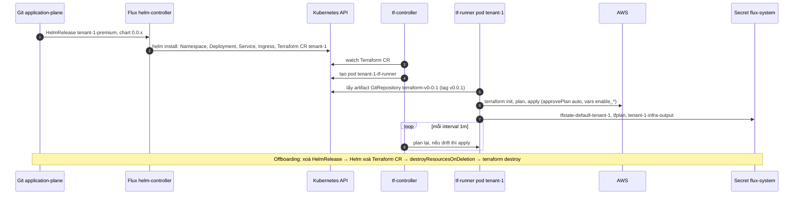
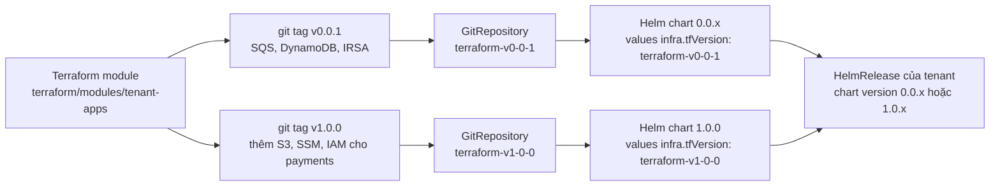

# 03 – Tofu Controller: Terraform module đi cùng Helm chart

File này trả lời: vì sao hạ tầng per-tenant (SQS, DynamoDB, IAM, S3) lại được tạo từ **bên trong Helm chart**, custom resource `Terraform` hoạt động thế nào, state và version được quản lý ở đâu, và Tofu Controller đứng ở đâu so với Crossplane.

> **Phiên bản.** Workshop cài chart `tf-controller 0.16.0-rc.4` từ `https://flux-iac.github.io/tofu-controller/`. Release mới nhất của dự án là **v0.16.5** (6/8/2026), repo flux-iac/tofu-controller vẫn hoạt động (commit cuối 21/9/2026). Dự án đổi tên từ tf-controller sang Tofu Controller khi hỗ trợ OpenTofu; tên chart và pod trong workshop vẫn là `tf-controller`, `tf-runner`. Support matrix chính thức: v0.16 đi với Flux v2.6.x và Terraform v1.5.7.

## Bài toán

Mỗi tenant Silo hoặc Bridge cần hạ tầng AWS riêng cho một số microservice: queue SQS cho producer gửi, table DynamoDB cho consumer ghi, IAM role qua IRSA, sau Lab 5 thêm S3 bucket và SSM parameter cho payments. Hạ tầng này có **vòng đời của tenant**: tạo khi onboard, xoá khi offboard, đổi khi package đổi version. Nếu để một pipeline Terraform riêng lo việc đó thì onboarding phải phối hợp hai hệ, và version hạ tầng dễ lệch version app.

Cách workshop chọn: hạ tầng là một **Terraform module** có sẵn, và Helm chart của tenant chứa một template sinh ra custom resource `Terraform`. Tofu Controller nhìn thấy CR đó và chạy module. Kết quả là `helm install` một tenant kéo theo cả Kubernetes resource và AWS resource, cùng một vòng đời, cùng một version.

## Terraform module `tenant-apps`

```text
terraform/modules/tenant-apps/
├── main.tf        # SQS, DynamoDB, IRSA role; sau Lab 5 thêm S3, SSM, IAM policy cho payments
├── data.tf
├── outputs.tf
├── variables.tf   # tenant_id, enable_producer, enable_consumer, enable_payments
└── versions.tf
```

Module nhận `tenant_id` và các cờ `enable_<service>`. Lab 1 cho chạy `terraform plan` tay để thấy: bật cả producer và consumer thì 11 resource, tắt producer còn 10. Đó là cách module phản ánh tier: cùng module, bật tắt theo service.

Module được **đóng gói bằng git tag** (`v0.0.1`, sau Lab 5 `v1.0.0`) thay vì registry. Mỗi tag có một Flux `GitRepository` riêng trỏ tới nó:

```yaml
# gitops/infrastructure/base/sources/terraform-git-v1.yaml
apiVersion: source.toolkit.fluxcd.io/v1
kind: GitRepository
metadata:
  name: terraform-v0-0-1
  namespace: flux-system
spec:
  interval: 300s
  url: "${gitea_url}/admin/eks-saas-gitops.git"
  ref:
    tag: "v0.0.1"
```

## Custom resource `Terraform` sinh từ Helm chart

Template trong chart, gần như nguyên văn:

```yaml
# helm-charts/helm-tenant-chart/templates/terraform.yaml
{{- if .Values.infra -}}
apiVersion: infra.contrib.fluxcd.io/v1alpha2
kind: Terraform
metadata:
  name: {{ .Values.tenantId }}
  namespace: flux-system
spec:
  path: ./terraform/modules/tenant-apps
  interval: 1m
  approvePlan: auto
  destroyResourcesOnDeletion: true
  sourceRef:
    kind: GitRepository
    name: {{ .Values.infra.tfVersion }}        # terraform-v0-0-1 hoặc terraform-v1-0-0
  vars:
    - name: tenant_id
      value: {{ .Values.tenantId }}
{{- range $appName, $appConfig := .Values.apps }}
    - name: "enable_{{ $appName }}"
      value: {{ $appConfig.enabled }}
{{- end }}
  writeOutputsToSecret:
    name: {{ .Values.tenantId }}-infra-output
{{ end }}
```

| Field | Ý nghĩa | Ghi chú |
|-------|---------|---------|
| `sourceRef` | Flux source chứa mã Terraform | Trỏ tới GitRepository theo tag, nên **version module bị khoá bởi chart**: `values.infra.tfVersion` mặc định `terraform-v0-0-1` ở chart 0.0.x, `terraform-v1-0-0` ở chart 1.0.0 |
| `path` | Thư mục module trong source | `./terraform/modules/tenant-apps` |
| `vars` | Biến vào module | `tenant_id` và một `enable_<app>` cho mỗi app trong values, lấy đúng giá trị `enabled` của tier. Đây là chỗ tier quyết định infra |
| `approvePlan: auto` | Apply ngay sau plan, không chờ duyệt | Cách khác: để trống rồi điền `plan-main-<hash>` qua Git để duyệt tay từng plan |
| `destroyResourcesOnDeletion: true` | Xoá CR thì `terraform destroy` | Offboarding xoá HelmRelease → Helm xoá CR → destroy. Không có field này thì AWS resource bị bỏ rơi |
| `interval: 1m` | Chu kỳ reconcile và drift detection | Mỗi phút plan lại; có drift thì apply sửa |
| `writeOutputsToSecret` | Ghi output module vào Secret | `<tenant>-infra-output` trong `flux-system`, để thành phần khác đọc queue URL, table name |

Vì `enabled` vừa điều khiển Deployment (template `deployment.yaml` chỉ render khi `$appConfig.enabled`) vừa điều khiển `enable_<app>` của Terraform, một field values quyết định cả app và infra của service đó. Lưu ý `values.yaml` mặc định của chart đã có `infra.tfVersion`, nên **mọi** HelmRelease đều render Terraform CR, kể cả tenant Basic. Với Basic mọi `enable_*` là false nên module gần như không tạo gì, nhưng vẫn có runner và state. Pool env có Terraform CR đầy đủ vì mọi service `enabled: true`.

## Runtime: controller, runner, state



Kiểm chứng trong workshop:

- `kubectl get po -n flux-system` thấy `tf-controller-...` và, khi có tenant, `tenant-1-tf-runner`. Log runner là log Terraform.
- `kubectl get secrets -n flux-system | grep state` thấy `tfstate-default-pool-1`, `tfstate-default-tenant-1`, `tenant-2`, `tenant-3`. Basic tenant `tenant-2` vẫn có state vì chart luôn render Terraform CR (xem trên), chỉ là module không tạo resource nào đáng kể khi mọi `enable_*` false.
- `aws dynamodb list-tables`, `aws sqs list-queues` thấy resource tiền tố `consumer-tenant-3-...` chỉ cho tenant Advanced và Premium.

State nằm trong Secret của cluster, không nằm ở S3 hay Terraform Cloud. Đơn giản cho workshop, nhưng production cần backup etcd hoặc cấu hình backend khác qua `backendConfig`.

## Version: chart khoá module



Đây là điểm thiết kế đáng nhớ nhất của workshop: **một số version chart kéo theo đúng một version module Terraform**. Khi deployment workflow đổi HelmRelease của một tier sang `1.0.x`, Terraform CR của tenant đó tự đổi `sourceRef` sang `terraform-v1-0-0`, runner plan và tạo thêm S3, SSM, IAM. Không cần bước "chạy Terraform trước" tách rời.

## Tofu Controller theo tài liệu chính thức

Bốn mô hình sử dụng mà dự án hỗ trợ:

| Mô hình | Ý | Trong workshop |
|---------|---|----------------|
| GitOps Automation | Plan và apply toàn bộ resource từ Git, `approvePlan: auto` | Đúng cách workshop dùng |
| Hybrid GitOps | Chỉ GitOps một phần hạ tầng có sẵn (ví dụ node group của EKS đã tồn tại) | Không dùng |
| State Enforcement | Có sẵn tfstate, chỉ dùng để ép trạng thái | Không dùng |
| Drift Detection only | Chỉ phát hiện drift, không apply | Không dùng |

Tính năng đáng biết ngoài phạm vi workshop:

- **Plan và duyệt tay**: để `approvePlan` trống, controller sinh plan và báo `set approvePlan: "plan-main-123"`; điền giá trị đó qua Git là apply. Cho phép review plan bằng PR.
- **`dependsOn` giữa các Terraform object**: xếp thứ tự module (network trước, database sau).
- **Multi-tenancy bằng runner per namespace**: `.metadata.namespace` và `.spec.serviceAccountName` quyết định runner chạy ở đâu với quyền gì. Workshop đặt hết trong `flux-system` với `allowCrossNamespaceRefs: true`, đơn giản nhưng mọi tenant dùng chung IRSA `tf-controller`.
- **Branch Planner** (tech preview): chạy plan cho từng PR và comment kết quả lên PR.
- **Tofu-Jet và primitive module**: module Terraform một resource, khai báo bằng YAML, không cần viết HCL.

## Tofu Controller khác Crossplane ở đâu

Ngắn gọn, chi tiết ở [decision guide](../03-tool-decision-guide.md):

| | Tofu Controller | Crossplane |
|---|---|---|
| Đơn vị | Một `Terraform` CR = một lần chạy module | Một Managed Resource = một object cloud; XR gom nhiều MR |
| Tái dùng | Module Terraform sẵn có, không sửa | Phải viết XRD và Composition, MR từ Provider |
| State | tfstate trong Secret, plan và apply theo chu kỳ | Không có state file, controller so trực tiếp với API cloud |
| Granularity drift | Theo cả module | Theo từng resource |
| API cho người dùng | Vẫn là Terraform vars | API mới do platform định nghĩa |
| Hợp khi | Team đã có module Terraform, muốn GitOps-ify dần | Muốn xây platform API, compose cả resource ngoài cloud |

Workshop chọn Tofu Controller vì mục tiêu là **tái dùng module Terraform** cho hạ tầng per-tenant và gói nó vào Helm chart. Series Crossplane chọn Crossplane vì mục tiêu là **API platform** kiểu `RegionalCluster`. Hai lựa chọn đều hợp lý với bài toán của mình.

## Nguồn

- Workshop: [Lab 1: App & Infra Blueprint](https://catalog.workshops.aws/eks-saas-gitops/en-US/03-lab1), trang "Terraform & OpenTofu Controller", "Integrating Helm Charts with Flux"; Lab 3 trang "Check Resources"; Lab 5 trang "Update Terraform module".
- Repo: `helm-charts/helm-tenant-chart/templates/terraform.yaml`, `values.yaml.template`, `gitops/infrastructure/production/07-tf-controller.yaml`, `gitops/infrastructure/base/sources/terraform-git-v1.yaml`, `terraform/modules/tenant-apps/`.
- [Tofu Controller docs](https://flux-iac.github.io/tofu-controller/) – Overview, Features, Support Matrix; [Branch Planner](https://flux-iac.github.io/tofu-controller/branch-planner/).
- [flux-iac/tofu-controller releases](https://github.com/flux-iac/tofu-controller/releases).
