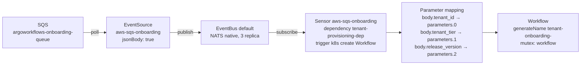
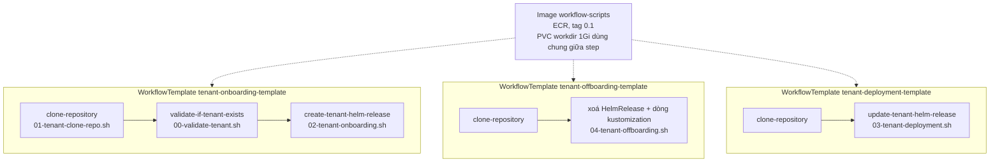
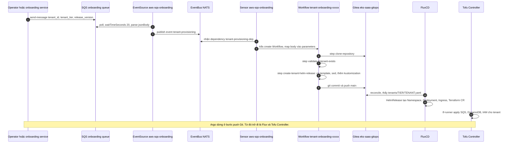

# 04 – Argo Events và Argo Workflows: tự động onboarding, offboarding, deployment

File này trả lời: một message SQS biến thành tenant chạy trong cluster bằng cách nào, Argo Events và Argo Workflows chia việc ra sao, ba workflow của workshop làm gì, và nguyên tắc nào giữ Argo không trở thành "hệ deploy ngầm".

> **Phiên bản.** Workshop cài Argo Workflows chart `0.40.11` và Argo Events chart `2.4.3` (năm 2024). Release hiện tại: Argo Workflows v4.1.4 (18/9/2026), Argo Events v1.9.11 (13/7/2026). Khái niệm không đổi, một vài field đổi tên, ghi chú ở cuối file.

## Vì sao cần workflow engine

Lab 2 cho làm tay: copy template, `sed` hai placeholder, thêm dòng vào `kustomization.yaml`, commit, push. Bốn bước đó lặp cho mỗi tenant, mỗi tier, mỗi lần đổi version. Argo Workflows chỉ làm đúng việc đó **tự động**, và Argo Events cho phép kích hoạt nó từ một event bên ngoài cluster (ở đây là SQS, do onboarding service hoặc operator gửi).

Câu tác giả nhấn mạnh: *Argo Workflows chỉ tự động hoá cái ta làm tay ở Lab 1; Flux vẫn là thứ reconcile từ Git và deploy vào EKS.*

## Argo Events: từ event tới Workflow

Bốn khối của Argo Events, đều nằm trong namespace `argo-events`:

| Khối | Vai trò | Trong workshop |
|------|---------|----------------|
| **EventBus** | Bus nội bộ chuyển event từ EventSource tới Sensor | `EventBus default`, NATS native, 3 replica |
| **EventSource** | Kết nối tới nguồn event bên ngoài, đẩy vào bus | `aws-sqs-onboarding`, `aws-sqs-deployment`, poll queue với `waitTimeSeconds: 20`, `jsonBody: true` để parse body |
| **Sensor** | Khai báo dependency (chờ event nào) và trigger (làm gì) | `aws-sqs-onboarding`: dependency `tenant-provisioning-dep`, trigger `k8s create` một `Workflow` |
| **Trigger** | Hành động khi dependency thoả | Tạo `Workflow` với `generateName: tenant-onboarding-`, tham số map từ body |

Phần đáng học nhất là **parameter mapping** trong Sensor: lấy field từ body SQS và ghi vào đúng vị trí trong spec của Workflow.

```yaml
# gitops/control-plane/production/workflows/tenant-onboarding-sensor.yaml (rút gọn)
kind: Sensor
spec:
  dependencies:
    - name: tenant-provisioning-dep
      eventSourceName: aws-sqs-onboarding
      eventName: tenant-provisioning
  triggers:
    - template:
        k8s:
          operation: create
          source:
            resource:
              kind: Workflow
              metadata: { generateName: tenant-onboarding-, namespace: argo-workflows }
              spec:
                entrypoint: tenant-provisioning
                synchronization: { mutex: { name: workflow } }
                arguments:
                  parameters:
                    - { name: TENANT_ID, value: "" }
                    - { name: TENANT_TIER, value: "" }
                    - { name: RELEASE_VERSION, value: "" }
                    - { name: REPO_URL, value: "${gitea_url}/admin/eks-saas-gitops.git" }
          parameters:
            - src: { dependencyName: tenant-provisioning-dep, dataKey: body.tenant_id }
              dest: spec.arguments.parameters.0.value
            - src: { dependencyName: tenant-provisioning-dep, dataKey: body.tenant_tier }
              dest: spec.arguments.parameters.1.value
            - src: { dependencyName: tenant-provisioning-dep, dataKey: body.release_version }
              dest: spec.arguments.parameters.2.value
```

`${gitea_url}` được Flux thay bằng `postBuild.substituteFrom` ConfigMap `saas-infra-outputs` trước khi apply.



## Argo Workflows: ba WorkflowTemplate

Workflow trong Sensor không chứa logic, chỉ gọi step qua `templateRef` tới **WorkflowTemplate** trong namespace `argo-workflows`. Mỗi step là một container chạy image `workflow-scripts` (build từ thư mục cùng tên, push lên ECR), mount chung một PVC `workdir` 1Gi để chia sẻ repo đã clone giữa các step.

| WorkflowTemplate | Trigger | Steps | Script | Kết quả trong Git |
|------------------|---------|-------|--------|-------------------|
| `tenant-onboarding-template` | queue onboarding, body `{tenant_id, tenant_tier, release_version}` | clone-repository → validate-if-tenant-exists → create-tenant-helm-release | `01-tenant-clone-repo.sh`, `00-validate-tenant.sh`, `02-tenant-onboarding.sh` | Thêm `tenants/<tier>/<tenant>.yaml`, thêm dòng vào `kustomization.yaml`, commit "Adding new tenant X in tier Y" |
| `tenant-offboarding-template` | queue offboarding, body `{tenant_id, tenant_tier}` | clone → remove | `04-tenant-offboarding.sh` | Xoá file tenant và dòng kustomization, commit |
| `tenant-deployment-template` | queue deployment, body `{tenant_tier, release_version}` | clone-repository → update-tenant-helm-release | `03-tenant-deployment.sh` | Regenerate **mọi** HelmRelease của tier từ template với version mới; nếu tier là basic thì cập nhật cả `pooled-envs/pool-1.yaml`; commit "Deploying to X tenants, version Y" |

Script onboarding rất ngắn: chọn template theo tier, `cp`, `sed` hai placeholder, `printf` thêm dòng vào kustomization, `git commit`, `git push`. Logic nghiệp vụ nằm ở **template**, không nằm ở workflow. Muốn đổi cách một tier được tạo, sửa template, không sửa Argo.



Hai chi tiết vận hành đáng nhớ:

- `synchronization.mutex.name: workflow` ở cấp Workflow: chỉ một workflow chạy tại một thời điểm, tránh hai workflow cùng push vào `main` và conflict. Docs hiện tại của Argo Workflows dùng dạng list `synchronization.mutexes: [{name: ...}]`, dạng số ít vẫn được chấp nhận nhưng đã cũ.
- ServiceAccount `argoworkflows-sa` gắn IRSA để pod có quyền AWS, và Git token được truyền qua parameter `GIT_TOKEN` từ ConfigMap. Workshop làm vậy cho gọn, production nên đưa token vào Secret và mount.

## Onboarding từ đầu tới cuối



Kiểm tra trong workshop: `kubectl -n argo-workflows get workflow` thấy `tenant-onboarding-gzt4s Running`, UI Argo Workflows hiện từng step và log, Gitea hiện commit mới, `flux get helmreleases` hiện `tenant-1-premium`.

## Nguyên tắc: Argo ghi Git, không ghi cluster

Cùng một nguyên tắc với promotion engine trong series Crossplane: **không hệ nào bypass Git**. Argo Workflows có toàn quyền tạo resource trong cluster (workshop cấp ClusterRole `*/*` cho `argoworkflows-sa`, chỉ để demo), nhưng workflow không `kubectl apply` gì cả. Nó chỉ commit. Nhờ vậy:

- Mọi tenant từng được tạo, xoá, nâng version đều có commit và diff để review.
- Rollback onboarding lỗi là revert commit.
- Flux vẫn là "immutability firewall" duy nhất.

So với series Crossplane:

| | Series Crossplane (blog) | Workshop AWS |
|---|---|---|
| Sinh config GitOps | Platform orchestration app tự viết | Argo Workflows + shell script |
| Quyết định promote | Promotion engine, đọc GitHub Deployments | Người gửi SQS message theo tier |
| Trigger | GitHub Deployment status | SQS message |
| Output | PR vào fleet repo | Commit thẳng vào main |
| Điểm mạnh | Có ngữ cảnh deploy, có approval | Có sẵn engine, UI, retry, mutex, không phải viết app |
| Điểm yếu | Phải viết và vận hành app riêng | Commit thẳng main không có review, cần thêm PR flow nếu muốn |

## Lưu ý khi mang ra khỏi workshop

- RBAC `apiGroups: ["*"] resources: ["*"] verbs: ["*"]` cho cả Argo Events và Argo Workflows là demo. Workflow chỉ cần quyền tạo pod và đọc Secret trong namespace của nó.
- `--auth-mode=server` trên Argo Workflows server là demo, production dùng SSO hoặc client auth.
- Commit thẳng `main` bỏ qua review. Muốn có review, workflow mở PR thay vì push, giống promotion engine của series 1.
- Pool env cố định `pool-1` trong `03-tenant-deployment.sh`. Muốn shard phải làm động.
- Onboarding service trong workshop chỉ là placeholder image `nginx`, thực tế đây là service nhận yêu cầu từ billing hoặc portal và gửi SQS.

## Nguồn

- Workshop: [Lab 3: Automating Tenant Onboarding/Offboarding](https://catalog.workshops.aws/eks-saas-gitops/en-US/04-lab3) và các trang con "Provision a Premium Tier Tenant", "Offboarding a Tenant"; Lab 5 trang "Wave Deployment across Tenant Tiers".
- Repo: `gitops/control-plane/production/workflows/*.yaml`, `gitops/infrastructure/production/03-argo-workflows.yaml`, `06-argo-events.yaml`, `workflow-scripts/*.sh`.
- [Argo Events – Architecture](https://argoproj.github.io/argo-events/concepts/architecture/), [Sensor](https://argoproj.github.io/argo-events/concepts/sensor/), [AWS SQS EventSource](https://argoproj.github.io/argo-events/eventsources/setup/aws-sqs/).
- [Argo Workflows – Synchronization](https://argo-workflows.readthedocs.io/en/latest/synchronization/) (mutexes, semaphores).
- Release: [argo-workflows](https://github.com/argoproj/argo-workflows/releases), [argo-events](https://github.com/argoproj/argo-events/releases).
