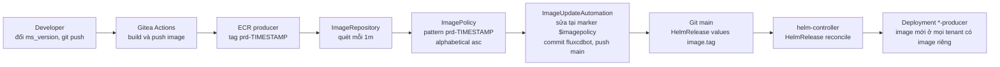
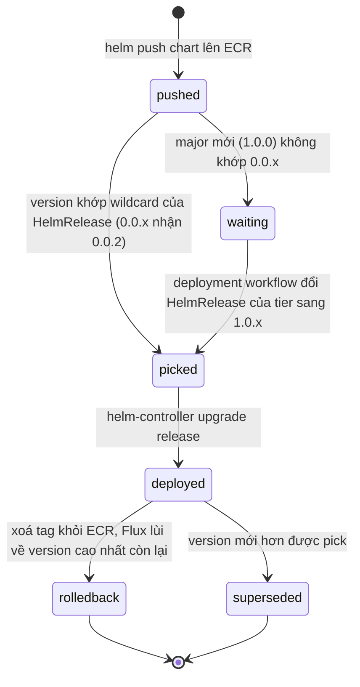
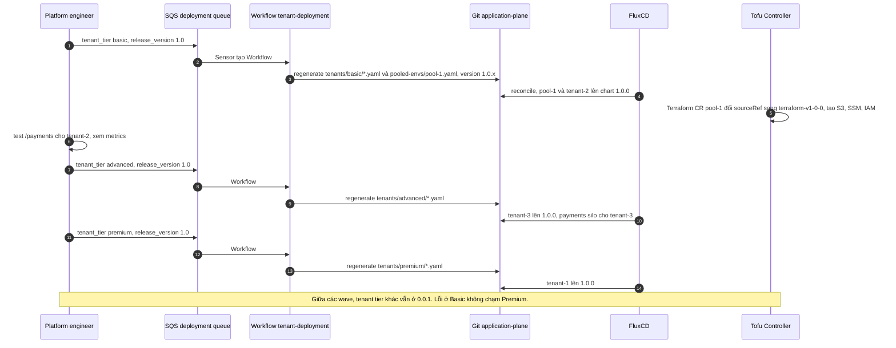

# 05 – Flux image automation, Helm versioning và staggered deployment

File này trả lời: code mới đi từ `git push` của developer tới pod của mọi tenant bằng cách nào mà không ai sửa HelmRelease bằng tay, wildcard version của Helm chart bảo vệ điều gì, rollback trong mô hình này nghĩa là gì, và vì sao thay đổi lớn phải đi theo wave từng tier.

> **Phiên bản.** Workshop dùng `image.toolkit.fluxcd.io/v1beta2` và `helm.toolkit.fluxcd.io/v2beta1`. Docs Flux hiện tại (v2.9.5) dùng `image.toolkit.fluxcd.io/v1` và `helm.toolkit.fluxcd.io/v2`. Field không đổi đáng kể, chỉ cần đổi apiVersion.

## Luồng 1: đổi code, Flux tự đẩy image tag

Ba resource của Flux image automation, tất cả trong `flux-system`:

| Resource | Việc | Trong workshop |
|----------|------|----------------|
| **ImageRepository** | Quét registry lấy danh sách tag | `producer-image-repository` trỏ ECR producer, `interval: 1m0s`, `secretRef: ecr-credentials` (CronJob làm mới token ECR) |
| **ImagePolicy** | Chọn **một** tag từ danh sách theo quy tắc | `filterTags.pattern: '^prd\-(?P<timestamp>.*)$'`, `extract: '$timestamp'`, `policy.alphabetical.order: asc`. Tag mới nhất là tag có timestamp lớn nhất |
| **ImageUpdateAutomation** | Sửa file trong Git tại các marker, commit, push | `producer-update-automation-tenants` sửa `application-plane/production/tenants/`, bản khác sửa `pooled-envs/`, commit tên `fluxcdbot`, push `main` |

Marker trong HelmRelease template cho controller biết sửa chỗ nào:

```yaml
image:
  tag: "0.1" # {"$imagepolicy": "flux-system:producer-image-policy:tag"}
```

Marker này có trong `premium_tenant_template.yaml` (cả producer và consumer), `advanced_tenant_template.yaml` (chỉ consumer, vì producer là pool) và `basic_env_template.yaml` (pool env). `basic_tenant_template.yaml` không có marker vì Basic không có image riêng.



Hệ quả cần thấy rõ: luồng này cập nhật **tất cả tenant cùng lúc**, kể cả Premium. Nó phù hợp cho patch nhỏ, không phù hợp cho thay đổi phá vỡ. Đó là lý do có luồng 2.

## Luồng 2: đổi chart, wildcard version quyết định

HelmRelease của tenant khai báo chart version dạng wildcard, sinh từ `{RELEASE_VERSION}.x`:

```yaml
chart:
  spec:
    chart: helm-tenant-chart
    version: "0.0.x"
    sourceRef: { kind: HelmRepository, name: helm-tenant-chart }   # OCI trên ECR
```

Quy tắc:

- Push chart `0.0.2` lên ECR → mọi HelmRelease `0.0.x` tự lên `0.0.2` sau interval. Lab 4 đổi resource request của consumer theo cách này.
- Push chart `1.0.0` → HelmRelease `0.0.x` **không** nhận. Muốn lên phải đổi HelmRelease sang `1.0.x`, và việc đó do deployment workflow làm theo từng tier (Lab 5).

Wildcard là chốt an toàn: patch tự chảy, major phải qua quyết định của người.



## Rollback theo cách của workshop, và cách khác

Lab 4 rollback bằng cách **xoá artifact khỏi ECR**: xoá image tag `prd-...` mới nhất thì ImagePolicy chọn tag cũ hơn, ImageUpdateAutomation commit ngược lại, Flux redeploy. Xoá chart `0.0.2` thì HelmRelease `0.0.x` lùi về `0.0.1`.

| Cách | Ưu | Nhược |
|------|----|-------|
| Xoá artifact khỏi registry (workshop) | Một lệnh, mọi tenant lùi đồng thời, không đụng Git | Mất artifact để điều tra, không rollback được một tenant, không có commit ghi nhận quyết định |
| Pin version trong Git | Có commit, chọn được tenant hoặc tier, giữ artifact | Phải sửa marker hoặc tạm dừng ImageUpdateAutomation, không thì bị ghi đè lại |
| Đổi ImagePolicy sang semver và tag theo semver | Loại được tag lỗi bằng cách không tag, rollback bằng range | Cần CI kỷ luật hơn |

Trong production nên coi cách của workshop là "chặt cầu dao", còn cách chuẩn là pin trong Git.

## Luồng 3: staggered deployment theo tier

Lab 5 là kịch bản thay đổi lớn: thêm microservice `payments`, cần thêm hạ tầng (S3, SSM parameter, IAM policy). Các bước:

1. Sửa Terraform module `tenant-apps`, `git tag v1.0.0`, tạo `GitRepository terraform-v1-0-0` trỏ tag đó.
2. Sửa chart: thêm `apps.payments`, đổi `infra.tfVersion: terraform-v1-0-0`, bump `Chart.yaml` lên `1.0.0`, `helm push` lên ECR.
3. Sửa 4 tier template: Premium và Advanced thêm `payments.enabled: true`, Basic thêm `payments` pool về `pool-1`, `basic_env_template` thêm payments `enabled: true`.
4. Gửi SQS deployment queue **theo từng tier**: `{tenant_tier: basic, release_version: "1.0"}` → quan sát → `advanced` → quan sát → `premium`.

Deployment workflow regenerate mọi HelmRelease của tier đó từ template với version mới, nên tenant vừa lên chart `1.0.x` vừa nhận thay đổi template (payments). Với `basic` nó còn regenerate `pool-1.yaml`, vì Basic tenant chỉ là route về pool.



Thứ tự **Basic → Advanced → Premium** không ngẫu nhiên: Basic là pool, rẻ, ít cam kết SLA, sửa nhanh nhất nếu hỏng. Premium là khách trả nhiều nhất, đi cuối khi đã có bằng chứng từ hai wave trước. Kết quả `flux get sources chart` sau wave đầu cho thấy đúng điều đó: `pool-1` và `tenant-2-basic` ở `1.0.0`, `tenant-1-premium` và `tenant-3-advanced` vẫn `0.0.1`.

## So với promotion trong series Crossplane

| | Series Crossplane | Workshop AWS |
|---|---|---|
| Đơn vị promote | Environment rồi region (staging → prod-eu-west-1 → prod-eu-central-1) | Tier trong một cluster (basic → advanced → premium) |
| Ai quyết định wave tiếp | Promotion engine đọc GitHub Deployments, có rule | Người gửi SQS message |
| Ghi nhận trạng thái | GitHub Deployment status | Commit message và `flux get` |
| Rollout patch nhỏ | Qua promotion engine | Flux image automation, tự động, mọi tenant |

Hai cách bổ nhau: trục region của series 1 và trục tier của series 2 có thể tồn tại cùng lúc trong một platform. Xem [decision guide](../03-tool-decision-guide.md) để chọn.

## Nguồn

- Workshop: [Lab 4: Deployment Automation with Flux](https://catalog.workshops.aws/eks-saas-gitops/en-US/05-lab4) và các trang con "Understanding the Automation Manifests", "Managing Helm Chart Updates", "Automating Rollbacks with Flux"; [Lab 5: Multi-tenant Staggered Deployments](https://catalog.workshops.aws/eks-saas-gitops/en-US/06-lab5) và trang "Wave Deployment across Tenant Tiers".
- Repo: `gitops/infrastructure/base/sources/producer-image-automation.yaml`, `workflow-scripts/03-tenant-deployment.sh`, `gitops/application-plane/production/tier-templates/`.
- [Flux – ImagePolicy](https://fluxcd.io/flux/components/image/imagepolicies/), [Flux – HelmRelease](https://fluxcd.io/flux/components/helm/helmreleases/), [Flux v2.9.5](https://github.com/fluxcd/flux2/releases/tag/v2.9.5).
