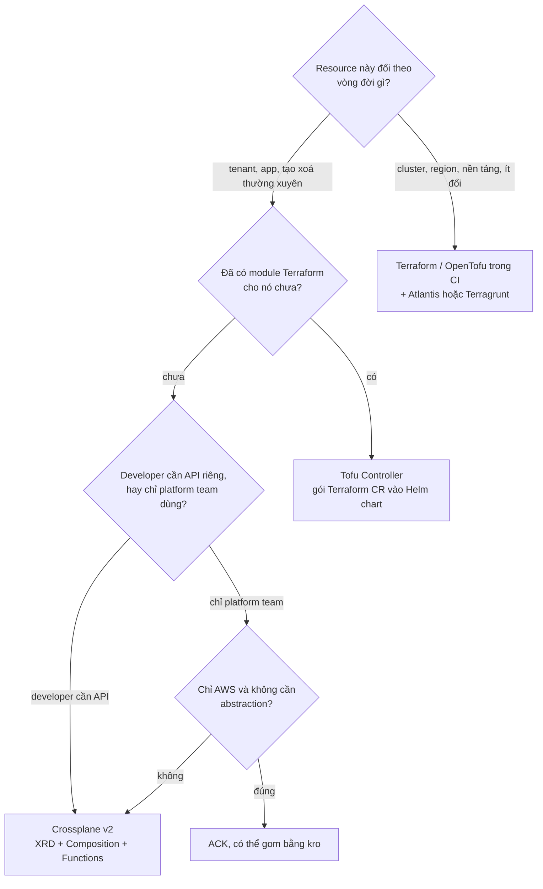

# 03 – Khi nào dùng tool nào: decision guide cho platform engineer

File này trả lời: đứng trước bài toán platform trên EKS, chọn Crossplane hay Tofu Controller, Flux hay Argo CD, tự viết orchestration app hay dùng Argo Workflows, promote bằng GitHub Deployments hay Kargo. Guide này rút từ hai nguồn đã đọc (series Crossplane multi-region và workshop AWS EKS SaaS GitOps) và mở rộng ra các tool thường bị so sánh cùng. Tool **ngoài hai nguồn** được đánh dấu rõ.

> **Phiên bản đối chiếu** (GitHub releases, 25/9/2026): Crossplane v2.4.2, Tofu Controller v0.16.5, Flux v2.9.5, Argo CD v3.5.3, Argo Workflows v4.1.4, Argo Events v1.9.11, Kargo v1.11.4, kro v0.9.4, Terraform v1.16.4, OpenTofu v1.12.6, Atlantis v0.48.0, Terragrunt v1.1.6, Karpenter v1.14.1. ACK (AWS Controllers for Kubernetes) phát hành theo từng controller, không có version chung. Context7 không kết nối được trong phiên viết, số liệu lấy trực tiếp từ GitHub.

## Sáu câu hỏi trước khi chọn tool

Chọn tool khó không phải vì thiếu tool, mà vì chưa trả lời bài toán. Trả lời sáu câu này trước, rồi mới nhìn bảng:

1. **Ai là người dùng API?** Developer tạo resource cho app của mình, hay chỉ platform team? Developer cần API đơn giản và guardrail. Platform team chịu được Terraform vars.
2. **Vòng đời resource gắn với cái gì?** Với cluster hay region (dài, ít thay đổi), với tenant (tạo xoá thường xuyên), hay với một lần deploy app?
3. **Có cần drift correction liên tục không?** Hay chỉ cần apply đúng lúc deploy và phát hiện drift định kỳ là đủ?
4. **Đã có Terraform module chưa?** Bao nhiêu, ai maintain, có muốn viết lại không?
5. **Cần approval flow ở đâu?** Ở plan hạ tầng, ở promote version, hay cả hai?
6. **Team quen gì và có bao nhiêu người vận hành?** Mỗi controller thêm vào cluster là một thứ phải nâng cấp, theo dõi, debug.

## Bản đồ 5 lớp

Hai nguồn đều chia platform thành lớp, chỉ khác tên. Guide này gom thành 5 lớp, mỗi lớp là một quyết định độc lập.

```mermaid
flowchart LR
    subgraph L1["1. Cloud infra provisioning"]
        XP["Crossplane<br/>(nguồn 1)"]
        TFC["Tofu Controller<br/>(nguồn 2)"]
        TFCI["Terraform / OpenTofu trong CI<br/>Atlantis, Terragrunt (ngoài)"]
        ACK["ACK (ngoài)"]
        KRO["kro (ngoài)"]
    end
    subgraph L2["2. Cluster reconciliation"]
        FLUX["Flux<br/>(cả 2 nguồn)"]
        ARGOCD["Argo CD (ngoài)"]
    end
    subgraph L3["3. Event và workflow"]
        AW["Argo Events + Workflows<br/>(nguồn 2)"]
        ORCH["Orchestration app tự viết<br/>(nguồn 1)"]
        CI["CI runner, GitHub Actions (ngoài)"]
    end
    subgraph L4["4. Promotion"]
        PE["Promotion engine + GitHub Deployments<br/>(nguồn 1)"]
        WAVE["Deployment workflow theo tier<br/>(nguồn 2)"]
        IMG["Flux image automation<br/>(nguồn 2)"]
        KARGO["Kargo (ngoài)"]
    end
    subgraph L5["5. Packaging"]
        HELM["Helm chart + HelmRelease template<br/>(nguồn 2)"]
        KUST["Kustomize overlay<br/>(nguồn 1)"]
        XR["Crossplane XR làm package<br/>(nguồn 1)"]
    end
    L1 --> L2 --> L3 --> L4 --> L5
```

Nguồn 1 là series Crossplane multi-region (blog). Nguồn 2 là workshop AWS EKS SaaS GitOps.

## Lớp 1: cloud infra provisioning

| Tiêu chí | Crossplane v2.4.2 | Tofu Controller v0.16.5 | Terraform/OpenTofu trong CI (+ Atlantis, Terragrunt) | ACK | kro v0.9.4 |
|----------|-------------------|-------------------------|------------------------------------------------------|-----|------------|
| Trong nguồn | Nguồn 1 | Nguồn 2 | Ngoài (workshop dùng Terraform để bootstrap, chạy tay) | Ngoài | Ngoài |
| Tái dùng module Terraform sẵn có | Không, viết Composition mới | Có, nguyên module | Có | Không | Không |
| State | Không có state file, controller so với cloud API | tfstate trong Secret (hoặc backend cấu hình) | Backend S3, Terraform Cloud | Không | Không |
| Drift correction | Liên tục, theo từng resource | Theo `interval`, plan lại cả module | Chỉ khi chạy pipeline | Liên tục | Phụ thuộc controller bên dưới |
| API abstraction cho developer | Mạnh: XRD + Composition, XR namespaced, compose bất kỳ resource | Yếu: vẫn là Terraform vars, có thể gói trong Helm | Không, HCL | Không, CRD 1:1 với AWS API | Mạnh: ResourceGraphDefinition gom CRD thành API mới |
| Multi-cloud | Có, Provider cho AWS, Azure, GCP, Kubernetes, Helm... | Có, bất kỳ provider Terraform | Có | Chỉ AWS | Chỉ gom CRD có sẵn |
| Approval flow | Không sẵn, làm qua PR vào Git | Có: `approvePlan` tay, Branch Planner | Có: PR + Atlantis plan comment | Không | Không |
| Vận hành | Nhiều controller (core + provider), CRD nhiều | Một controller, runner pod per CR | Không thêm gì vào cluster | Một controller per service AWS | Một controller |
| Độ chín | v2 GA từ 2025, hệ sinh thái Function | Ổn định nhưng phiên bản 0.x, đội nhỏ | Chuẩn ngành | GA, do AWS maintain | 0.x, dự án mới của AWS, Azure, GCP |

Rule of thumb:

- **Đã có module Terraform lớn và muốn GitOps-ify dần** → Tofu Controller. Đây đúng là bài toán của workshop: module `tenant-apps` có sẵn, chỉ cần gắn vào vòng đời tenant.
- **Muốn định nghĩa API platform cho developer** (`RegionalCluster`, `Database`, `App`) và có thể compose cả resource không phải cloud → Crossplane v2. Đây là bài toán của series 1.
- **Chỉ AWS, muốn CRD 1:1 và không cần abstraction** → ACK. Có thể đặt dưới Crossplane hoặc kro.
- **Đã có CRD (ACK, operator) và chỉ cần gom thành API đơn giản, không muốn học Composition Function** → kro. Còn mới, theo dõi thêm.
- **Hạ tầng nền tảng đổi rất ít** (VPC, EKS cluster, IAM nền) → Terraform trong CI với Atlantis là đủ và ít rủi ro nhất. Workshop tự bootstrap bằng Terraform tay, chỉ đưa hạ tầng per-tenant vào controller.

Hai tool có thể sống chung: Crossplane cho API platform, Tofu Controller cho phần module Terraform legacy chưa kịp chuyển. Đừng ép chọn một.

## Lớp 2: cluster reconciliation (GitOps engine)

Cả hai nguồn chọn Flux, nhưng Argo CD là lựa chọn phổ biến không kém.

| Tiêu chí | Flux v2.9.5 | Argo CD v3.5.3 (ngoài) |
|----------|-------------|------------------------|
| Mô hình | Bộ controller nhỏ, không UI mặc định (Capacitor, Weave GitOps bên thứ ba) | Một ứng dụng có UI, API, CLI, SSO |
| Đơn vị | `Kustomization`, `HelmRelease`, `GitRepository`, `OCIRepository` | `Application`, `ApplicationSet`, `AppProject` |
| Multi-tenancy | Namespace-scoped, `serviceAccountName` per Kustomization, không cross-namespace mặc định | `AppProject` giới hạn source, destination, RBAC theo project |
| Helm | helm-controller làm `helm install` thật, có release history, upstream Helm v4 từ v2.9.5 | Render `helm template` rồi apply, không có Helm release |
| Image automation | Có sẵn: ImageRepository, ImagePolicy, ImageUpdateAutomation | Argo CD Image Updater, dự án riêng |
| Sinh nhiều app từ mẫu | Kustomize + `postBuild.substituteFrom`, hoặc tool ngoài sinh file (Argo Workflows, orchestration app) | `ApplicationSet` generator (list, cluster, git directory, pull request) |
| Dependency | `dependsOn` giữa Kustomization và HelmRelease | Sync wave, sync hook |
| Phù hợp | Platform team thích Kubernetes-native, ít UI, nhiều cluster độc lập, cần image automation và Helm thật | Team cần UI cho developer xem trạng thái, RBAC theo project, nhiều app từ generator |

Rule of thumb: **đã dùng Helm nghiêm túc và muốn Helm release thật, hoặc cần image automation** → Flux. **Developer cần UI tự phục vụ và RBAC theo team** → Argo CD. Cả hai chạy chung được (Flux cho platform, Argo CD cho app team) nhưng tăng chi phí vận hành.

Workshop dùng `postBuild.substituteFrom` ConfigMap `saas-infra-outputs` để đưa output Terraform vào manifest. Đó là tính năng nhỏ nhưng là lý do Flux ghép mượt với Terraform bootstrap.

## Lớp 3: event và workflow orchestration

Cả hai nguồn đều cần một thứ **sinh file GitOps** thay người: series 1 tự viết orchestration app, series 2 dùng Argo Events + Argo Workflows với shell script.

| Tiêu chí | Argo Events + Workflows (nguồn 2) | Orchestration app tự viết (nguồn 1) | CI runner, GitHub Actions (ngoài) | Flux notification-controller Receiver (ngoài) |
|----------|-----------------------------------|-------------------------------------|-----------------------------------|------------------------------------------------|
| Trigger | SQS, SNS, webhook, cron, Kafka... qua EventSource | Tuỳ viết | Push, PR, schedule, `repository_dispatch` | Webhook để ép reconcile, không chạy logic |
| Multi-step, retry, mutex | Có sẵn, có UI xem từng step | Tự viết | Có job, step, concurrency group | Không |
| Chạy trong cluster | Có, cần Karpenter hoặc node cho pod workflow | Tuỳ | Ngoài cluster | Trong cluster |
| Logic nghiệp vụ | Trong script hoặc container step | Trong code app | Trong workflow YAML và script | Không |
| Chi phí | Thêm 2 hệ (Events, Workflows), RBAC, EventBus | Phải viết, test, vận hành app | Gần như không nếu đã có CI | Không |
| Hợp khi | Nhiều loại workflow (onboarding, offboarding, deployment), cần audit từng step, event từ hệ khác (billing gửi SQS) | Logic onboarding phức tạp, cần validate theo model nội bộ, muốn mở PR có template | Ít workflow, trigger từ Git là chính | Chỉ cần "reconcile ngay" |

Rule of thumb: **bắt đầu bằng CI**. Khi số workflow tăng, cần trigger từ hệ ngoài Git, cần mutex và UI theo step → Argo Workflows. Chỉ **tự viết app** khi logic onboarding mang nhiều nghiệp vụ (kiểm tra billing, quota, naming) mà script không đủ. Kể cả khi tự viết, hãy để app **chỉ commit Git**, đúng nguyên tắc cả hai nguồn nhấn mạnh.

## Lớp 4: promotion

Bốn cách promote đã gặp, và Kargo là tool chuyên dụng đáng biết.

| Tiêu chí | Promotion engine + GitHub Deployments (nguồn 1) | Deployment workflow theo tier (nguồn 2) | Flux image automation (nguồn 2) | Kargo v1.11.4 (ngoài) |
|----------|--------------------------------------------------|----------------------------------------|--------------------------------|------------------------|
| Trục promote | Environment rồi region | Tier trong một cluster | Không có trục, mọi nơi cùng lúc | Stage do người định nghĩa (env, region, tier đều được) |
| Ai quyết định | Engine theo rule, đọc deployment status | Người gửi SQS | Không ai, tự động | Kargo theo policy, có approval tay |
| Ngữ cảnh | GitHub Deployment status, lịch sử | Commit message | Tag mới nhất | Freight (bó artifact: image, chart, commit) đi qua Stage |
| Output | PR vào fleet repo | Commit thẳng main | Commit của fluxcdbot | Commit hoặc PR vào Git |
| Verify | Engine quan sát health rồi mới đi tiếp | Người quan sát | Không | Analysis (Argo Rollouts AnalysisTemplate) |
| Phải viết | Cả engine | Chỉ script | Không | Không, chỉ khai báo Warehouse, Stage |
| Hợp khi | Muốn ràng buộc chặt với CI và GitHub, có rule riêng | SaaS nhiều tier, muốn wave theo tier, đội nhỏ | Patch nhỏ, môi trường dev, hoặc lớp dưới của một cách khác | Nhiều stage, cần UI, cần gom nhiều artifact thành một đơn vị promote |

Rule of thumb: **Flux image automation là lớp nền cho patch** trong mọi kịch bản. Phía trên nó, **đội nhỏ, ít stage** → workflow theo tier hoặc theo env bằng Argo Workflows. **Đã sống trên GitHub Actions và muốn deployment status là nguồn sự thật** → promotion engine như series 1, hoặc dùng GitHub Environments với required reviewers trước khi tự viết. **Nhiều stage, nhiều artifact, cần approval và UI** → Kargo, trước khi tự viết engine.

Điều cả bốn cách đồng ý: **output của promote là một Git change**. Tool nào promote bằng cách `kubectl apply` thẳng vào cluster là tool đang phá GitOps.

## Lớp 5: packaging

| Tiêu chí | Helm chart + HelmRelease template (nguồn 2) | Kustomize overlay per target (nguồn 1) | Crossplane XR làm package (nguồn 1, mở rộng) |
|----------|---------------------------------------------|----------------------------------------|----------------------------------------------|
| Đơn vị | Một chart cho mọi tenant, values quyết định tier | Một base + overlay cho mỗi env hoặc region | Một XRD định nghĩa "App" hoặc "Tenant", Composition sinh Deployment, Service, MR |
| Kéo theo infra | Có, template sinh Terraform CR | Không, infra ở lớp khác | Có, cùng Composition |
| Version | Semver chart, wildcard `0.0.x` | Git ref | Composition revision |
| Ai sửa | Platform team sửa chart, tier template; app team sửa image | App team sửa overlay của mình | Platform team sửa Composition; app team tạo XR |
| Hợp khi | Nhiều instance giống nhau khác tham số (tenant, pool) | Ít instance, mỗi cái khác nhau nhiều (env, region) | Muốn một API duy nhất cho cả app và infra, đã dùng Crossplane v2 |

Rule of thumb: **hàng chục đến hàng nghìn instance cùng hình dạng** → Helm chart + template, đúng bài toán tenant. **Vài môi trường khác nhau nhiều** → Kustomize overlay. **Đã có Crossplane v2 và muốn developer chỉ tạo một object** → XR namespaced compose cả Deployment và MR, đây chính là điểm mới của Crossplane v2.

## Ghép bộ theo tình huống

| Tình huống | Lớp 1 infra | Lớp 2 GitOps | Lớp 3 workflow | Lớp 4 promote | Lớp 5 package | Tránh |
|------------|-------------|--------------|----------------|---------------|---------------|-------|
| **A. Platform multi-region, ít tenant, mỗi region một stack** (giống series 1) | Crossplane XR `RegionalCluster` per region; Terraform CI cho account nền | Flux ở management cluster và mỗi workload cluster | CI để bắt đầu; orchestration app khi onboarding nhiều app | Flux image automation cho patch; promote theo region bằng Kargo hoặc engine riêng | Kustomize overlay per region | Đừng để Crossplane quyết định release |
| **B. SaaS multi-tenant nhiều tier trong một hoặc vài cluster** (giống series 2) | Tofu Controller cho infra per-tenant nếu đã có module; Crossplane nếu viết mới | Flux | Argo Events + Workflows cho onboarding, offboarding, wave | Image automation cho patch; workflow theo tier cho major; Kargo khi cần approval | Một Helm chart + tier template | Đừng commit thẳng main không review ở production |
| **C. Team đã có kho Terraform lớn, muốn GitOps mà không viết lại** | Tofu Controller, dùng `approvePlan` tay và Branch Planner cho module quan trọng; Terraform CI cho phần còn lại | Flux | CI | Image automation + PR | Helm hoặc Kustomize tuỳ app | Đừng chuyển sang Crossplane chỉ vì "mới hơn" |
| **D. Greenfield, muốn developer tự phục vụ qua API** | Crossplane v2 với XRD namespaced; ACK bên dưới nếu chỉ AWS; cân nhắc kro nếu chỉ gom CRD | Flux hoặc Argo CD tuỳ nhu cầu UI | CI, sau đó Argo Workflows khi cần event ngoài | Kargo | XR làm package cho app + infra | Đừng expose Managed Resource thô cho developer |

## Ba nguyên tắc chung rút từ hai nguồn

1. **Git là source of truth, mọi tool khác chỉ đọc hoặc ghi Git.** Crossplane, Tofu Controller, Flux đọc. Orchestration app, Argo Workflows, promotion engine, Kargo ghi. Không tool nào apply thẳng.
2. **Tách "package" khỏi "tham số".** Composition và Helm chart là package. XR và HelmRelease template là tham số. Đổi package không đổi API người dùng; đổi tham số không đụng package.
3. **Chọn tool theo vòng đời resource, không theo độ nổi.** Hạ tầng nền đổi hiếm thì CI là đủ. Hạ tầng theo tenant đổi mỗi ngày thì cần controller trong cluster. Release đổi mỗi giờ thì cần automation có chốt an toàn (wildcard version, wave theo tier).

## Bảng version tổng hợp

| Tool | Version | Ngày release | Nguồn |
|------|---------|--------------|-------|
| Crossplane | v2.4.2 | 22/9/2026 | Nguồn 1 |
| provider-upjet-aws | v2.8.1 | 21/9/2026 | Nguồn 1 |
| Flux | v2.9.5 | 31/8/2026 | Cả hai |
| Tofu Controller | v0.16.5 | 6/8/2026 | Nguồn 2 |
| Argo Workflows | v4.1.4 | 18/9/2026 | Nguồn 2 |
| Argo Events | v1.9.11 | 13/7/2026 | Nguồn 2 |
| Karpenter (AWS) | v1.14.1 | 21/8/2026 | Nguồn 2 |
| AWS Load Balancer Controller | v3.5.0 | 3/8/2026 | Nguồn 2 |
| Argo CD | v3.5.3 | 14/9/2026 | Ngoài |
| Kargo | v1.11.4 | 3/9/2026 | Ngoài |
| kro | v0.9.4 | 4/9/2026 | Ngoài |
| Terraform | v1.16.4 | 23/9/2026 | Ngoài |
| OpenTofu | v1.12.6 | 19/8/2026 | Ngoài |
| Atlantis | v0.48.0 | 22/9/2026 | Ngoài |
| Terragrunt | v1.1.6 | 21/9/2026 | Ngoài |
| ACK | theo từng controller | | Ngoài |

## Nguồn

- Series 1: [Building a Multi-Region EKS Platform with Crossplane, FluxCD, and GitOps](https://medium.com/@kostasdihalas/building-a-multi-region-eks-platform-with-crossplane-fluxcd-and-gitops-c0b3ea4dd567), [Provisioning Multi-Region AWS Infrastructure with Crossplane](https://medium.com/@kostasdihalas/provisioning-multi-region-aws-infrastructure-with-crossplane-c5010fb39b5f).
- Series 2: [Building SaaS applications on Amazon EKS using GitOps](https://catalog.workshops.aws/eks-saas-gitops/en-US/01-introduction), [aws-samples/eks-saas-gitops](https://github.com/aws-samples/eks-saas-gitops).
- Docs: [Crossplane v2](https://docs.crossplane.io/latest/whats-new/), [Tofu Controller](https://flux-iac.github.io/tofu-controller/), [Flux](https://fluxcd.io/flux/), [Argo CD](https://argo-cd.readthedocs.io/), [Argo Workflows](https://argo-workflows.readthedocs.io/), [Argo Events](https://argoproj.github.io/argo-events/), [Kargo](https://docs.kargo.io/), [kro](https://kro.run/), [ACK](https://aws-controllers-k8s.github.io/community/), [AWS SaaS Lens](https://docs.aws.amazon.com/wellarchitected/latest/saas-lens/).
- Phần so sánh và rule of thumb là nhận định tổng hợp của ghi chú này, không nằm nguyên văn trong nguồn.
