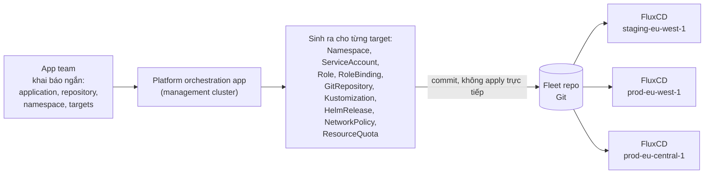
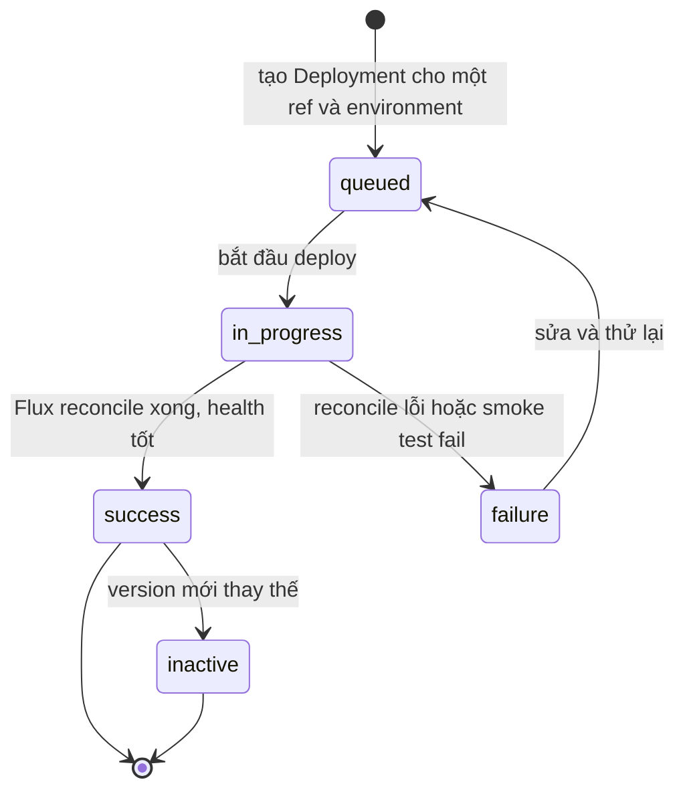
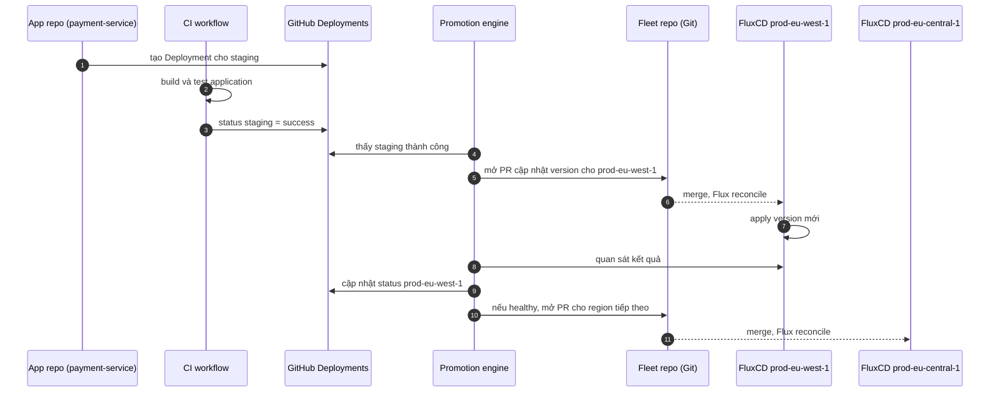

# 05 – Onboarding và promotion

File này trả lời: sau khi Crossplane đã tạo xong cluster, app team được onboard vào cluster thế nào, và một version được promote qua staging rồi từng production region theo cách nào. Đây là lớp 3 và lớp 4 trong kiến trúc, nằm **ngoài** Crossplane, nhưng cần hiểu để thấy Crossplane dừng ở đâu.

## Lớp 3: Platform orchestration app

Flux mạnh, nhưng bắt mọi app team tự viết Flux resource thì developer experience kém. Với mỗi app, mỗi cluster, mỗi region, mỗi environment, cần sinh ra:

Namespace, ServiceAccount, Role, RoleBinding, GitRepository, Kustomization, HelmRelease (tuỳ chọn), NetworkPolicy, ResourceQuota mặc định.

Nhân lên với nhiều app, nhiều cluster, nhiều region, nhiều environment thì lặp và dễ sai. Orchestration app cho một giao diện cao hơn. App team chỉ cần khai báo:

```yaml
application: payment-service
repository: github.com/example/payment-service
namespace: payment-service
targets:
  - environment: staging
    cluster: staging-eu-west-1
    path: ./deploy/overlays/staging
  - environment: production
    cluster: prod-eu-west-1
    path: ./deploy/overlays/prod-eu-west-1
  - environment: production
    cluster: prod-eu-central-1
    path: ./deploy/overlays/prod-eu-central-1
```

Orchestration app sinh ra config GitOps mức thấp và **commit vào fleet repo**. Nó không mutate cluster trực tiếp. Flux ở từng cluster reconcile phần của mình.



## Lớp 4: Promotion engine và GitHub Deployments

Flux reconcile desired state rất tốt, nhưng không quyết định chính sách rollout mức nghiệp vụ:

- Version này được chuyển từ staging lên production chưa?
- Smoke test pass chưa? Đã được approve chưa?
- Version này đã chạy ở region khác chưa?
- `prod-eu-west-1` xong chưa trước khi `prod-eu-central-1` bắt đầu?
- Có nên tạm dừng promote vì error rate tăng?

Tác giả dùng **GitHub Deployments** làm ngữ cảnh chung. Một GitHub Deployment là yêu cầu deploy một ref (branch, SHA, tag) tới một environment. Deployment status cho vòng đời: `queued`, `in_progress`, `success`, `failure`, `inactive`. Promotion engine đọc ngữ cảnh này để biết chuyện gì đã xảy ra, cái gì đang chạy, và bước tiếp theo được phép là gì. GitHub Deployments trở thành ngôn ngữ chung giữa app repo, CI và promotion engine.



## Quy tắc thiết kế quan trọng nhất

Promotion engine **không được** trở thành hệ thống deploy ngầm. Không chạy `kubectl apply`, không mutate production cluster trực tiếp. Nó dùng GitHub Deployments làm ngữ cảnh, đánh giá promotion rule, rồi **tạo Git change**. Flux áp dụng thay đổi đó.

Bảy bước trong bài:



Git là source of truth. Promotion engine ra quyết định. Flux áp dụng desired state. Crossplane giữ hạ tầng bên dưới tồn tại. Bốn vai trò, không chồng lấn.

## Tóm lại cả series

| Thành phần | Mang lại |
|------------|----------|
| Crossplane | Hạ tầng dưới dạng API |
| FluxCD | Reconcile liên tục |
| Orchestration app | Developer experience tốt hơn |
| Promotion engine | Rollout có kiểm soát qua environment và region |
| GitHub Deployments | Ngữ cảnh và lịch sử deploy |
| Git | Auditability |

Một platform multi-region EKS không chỉ là tập hợp cluster. Nó là một control plane.

## Nguồn

- [Building a Multi-Region EKS Platform with Crossplane, FluxCD, and GitOps](https://medium.com/@kostasdihalas/building-a-multi-region-eks-platform-with-crossplane-fluxcd-and-gitops-c0b3ea4dd567) – mục "Why an orchestration app?", "Why GitHub Deployments?", "The most important design rule", "Final thoughts".
